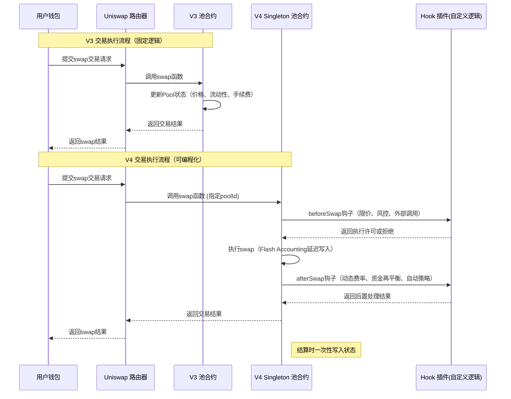

# 1. AMM（自动做市商）原理

## AMM 基本概念

AMM（Automated Market Maker）是一种不依赖传统订单簿的交易机制， 它使用 **数学公式** 来决定交易价格和池子内资产的比例。 在最常见的 **恒定乘积模型（Constant Product Market Maker，CPMM）** 中，核心公式是：
$$
x * y = k
$$

- *x*：池子中 **Token A** 的数量
- *y*：池子中 **Token B** 的数量
- *k*：常数（表示流动性池的“体积”，如果没有添加或移除流动性则保持不变）


## 价格推导

**价格**基于池子中的**两种资产数量比例**决定：

对于 **Token A**（以 Token B 定价）的价格公式：Pa = y / x

对于 **Token B**（以 Token A 定价）的价格公式：Pb = x / y


假设池子初始状态：

- x=100 Token A
- y=200 Token B
- k=100⋅200=20,000 

那么 Token A 的单价： Pa=200 / 100=2 (每个A值2个B)


## Swap 过程：价格如何变化

当有人用 Token B 购买 Token A 时（即往池子添加 Token B、取走 Token A）：

1. *y* 增加（因为有人加入 Token B）
2. *x* 减少（因为取走了 Token A）
3. 为保持 *k* 不变，池子会自动调整价格 PA = y / x


**数学推演例子**：

 假设用户用 20 Token B 买 Token A：

- 初始：x=100，y=200，k=20,000
- 新的 y=200+20=220
- 由恒等式 x′⋅220=20,000 得： x′=20,000/220≈90.91
- 用户获得的 Token A 数量： 100−90.91≈9.09

价格变化：

- 交易前：PA=200/100=2
- 交易后：PA′=220/90.91≈2.42（价格上涨）

这说明**价格是滑动的**，买入越多，价格涨得越快，这就是 **滑点（Slippage）**。


## 收付费机制

Uniswap v2 默认交易手续费为 **0.3%**，其作用是：

- 按比例加入到流动性池中，不改变 x⋅y=k 恒等式的核心条件
- 奖励流动性提供者（LP）
- 实际计算：
  - 如果用户想交换 Δy的 Token B，扣除手续费 Δyfee=0.003×Δy
  - 实际进入池子的 Token B 数量: yin=Δy×(1−0.003)

手续费的引入会让 k*k* 增加，从而导致流动性池变大，有利于下次交易的价格稳定。


## 套利机制

AMM 内部价格不一定与外部市场实时一致，如果不同，就会吸引套利者来操作：

- 当 AMM 内价格 < 外部市场价格 → 套利者买进池中便宜资产，卖到外部市场获利
- 当 AMM 内价格 > 外部市场价格 → 套利者在外部市场买便宜资产，卖进池中获利

**套利的结果**： 池子比例被自动推回到接近外部市场价格。 所以，长期来看，AMM 的价格 = 外部市场价格 ± 滑点/手续费差。


--------

# Uniswap V2 、V3 、V 4 

## **Uniswap V2（2020）**


🔥 **核心特征**

- 恒定乘积做市商（CPMM）公式： x⋅y=k
- 流动性分布在 **无限价格范围**，即使在价格远离当前市场价格的区间，也有资金被锁定 → **资本效率低**
- 单一交易费率（默认 0.3%）
- LP 收益平均按整个池子比例分配
- **价格预言机（TWAP）**：用于外部合约获取历史价格，安全但 gas 成本高

💬 **优缺点**：

- ✅ 简单，任何用户都能轻松做市
- ❌ **资金利用率低**，大部分资金在非活跃价格区间

-------

## **Uniswap V3（2021）**

🔥 **核心特征**

- **集中流动性（CLMM）**：LP 可以选择一个价格区间 `[tickLower, tickUpper]` 提供流动性，比如 [1800,2200][1800,2200]，资金只在区间内交易 → 提高资本效率，减少滑点
- **Ticks (价格刻度)**：每个 Tick 都对应一个具体的价格。 价格与 Tick 索引 `i` 的关系是 `price = 1.0001^i`。例如，`tick 0` 对应价格 `1.0`，`tick 1` 对应 `1.0001`，`tick 10000` 对应 `1.0001^10000 ≈ 2.718`。
- **Tick Spacing (刻度间距)**：为了防止 Tick 数量过多导致 Gas 成本过高，V3 对不同手续费率的池设定了不同的 `tickSpacing`。LP 只能在 `tickSpacing` 的整数倍位置上设置区间边界。例如，`tickSpacing = 60` 时，LP 可以选择 `tick 86040` 作为下界，但不能选择 `86041`。
  - 0.01% 费率池: `tickSpacing = 1` (最高精度)
  - 0.05% 费率池: `tickSpacing = 10`
  - 0.3% 费率池: `tickSpacing = 60`
  - 1% 费率池: `tickSpacing = 200` (最低精度)
- **资本效率**显著提升，同等交易深度所需资金比 V2 少 10~20 倍
- TWAP 优化，gas 消耗降低
- 收益分配精准：只给区间内活跃的 LP 交易分成

💬 **优缺点**：

- ✅ 资金效率更高，滑点更低
- ❌ LP 管理更复杂，当价格离开区间时，资金不再赚手续费，而且变为单一资产


### 案例分析：创建并管理一个流动性头寸

**场景**: 假设当前 ETH/USDC 价格为 1800 USDC/ETH，对应的 Tick 索引约为 `86031`。Bob 认为未来价格会在 1700 到 1900 USDC/ETH 之间波动，他决定在 0.3% 费率的池（`tickSpacing = 60`）中添加流动性。


**步骤 1: Bob 选择价格区间**

- Bob 选择的价格区间是 1700 USDC/ETH 到 1900 USDC/ETH。
- 他需要计算出这个价格区间对应的 Tick 索引，并将其调整为 `tickSpacing`（60）的整数倍。
  - `price = 1700` → `tickLowerRaw ≈ 84222` → `tickLower = 84222 - (84222 % 60) = 84240`
  - `price = 1900` → `tickUpperRaw ≈ 87729` → `tickUpper = 87729 + (60 - (87729 % 60)) = 87780`
- 所以，Bob 的头寸区间是 `[84240, 87780]`。

**步骤 2: Bob 添加流动性**

- Bob 通过 `NonfungiblePositionManager` 的 `mint` 函数，指定 `tickLower=84240`, `tickUpper=87780`，并转入相应的 ETH 和 USDC。
- `Pool` 合约的 `_updatePosition` 函数被调用：
  1. 计算并锁定 Bob 转入的资产。
  2. 在 `positions` 映射中为 Bob 创建一个新的记录，记录他在此区间的流动性 `L`。
  3. 调用 `_updateTick(84240, +L)` 和 `_updateTick(87780, +L)`，将 Bob 的流动性添加到这两个关键 Tick 上。

**步骤 3: 交易发生，Bob 赚取手续费**

- 当市场价格在 `[84240, 87780]` 区间内时，任何 ETH/USDC 的交易都会激活 Bob 的流动性。

- 每一笔交易都会通过 `swap` 函数中的 `step` 循环，并更新 `feeGrowthGlobal0X128` 和 `feeGrowthGlobal1X128`。

- Bob 头寸的 `feeGrowthInside0X128` 和 `feeGrowthInside1X128` 记录了他上次操作时的全局手续费累积值。

- 他应得的手续费计算公式为：

  ```
  earned0 = (feeGrowthGlobal0X128 - feeGrowthInside0X128) * Bob's Liquidity / (1 << 128)
  ```

  ```
  earned1 = (feeGrowthGlobal1X128 - feeGrowthInside1X128) * Bob's Liquidity / (1 << 128)
  ```

**步骤 4: Bob 调整或移除流动性**

- 如果 Bob 认为价格即将超出他的区间，他可以调用 `decreaseLiquidity` 函数来部分或全部移除他的流动性。
- 合约会再次调用 `_updatePosition`，这次 `liquidityDelta` 为负数。
- 在更新流动性之前，合约会计算并支付自上次以来 Bob 累积的所有手续费（`earned0` 和 `earned1`）。
- 最后，更新 `positions` 和 `_updateTick` 中的流动性数据。

------

##  **Uniswap V4**

🔥 **核心特征**

- **Hooks 插件系统**（重大升级）：允许开发者在 swap 前后执行任意逻辑，例如：
  - 动态调整费率
  - 在交易前后触发限价单
  - 自动将手续费再投资
  - 接入外部预言机
- **单合约多池架构**：所有池共享一个主合约，减少 gas 成本，部署更轻量
- **任意价格曲线**：不仅限于恒定乘积 AMM，可以做：
  - 恒定和差（stable swap）模型（像 Curve）
  - 外部价格参考模型（例如链下价格）
  - 混合 AMM+订单簿
- **动态费率**：可根据交易量或波动性自动调整
- **共享流动性池**：不同交易对可以共享流动性，提高跨资产利用率

💬 **优缺点**：

- ✅ 高度可扩展，可兼容不同 AMM 模型甚至订单簿
- ❌ 开发和安全审计复杂，对 LP 和开发者技术要求更高


在 **Uniswap V4**，Hook 本质就是在交易生命周期的关键节点插入链上逻辑，所以可以实现很多原本 V3 做不到的功能。主要有这几类：

| 功能类别                | 能做的事                                         | 实现原理                                                    |
| ----------------------- | ------------------------------------------------ | ----------------------------------------------------------- |
| **交易条件控制**        | 限价单、止损单、白名单交易、Token 黑名单         | 在 `beforeSwap` 读取价格、地址等条件，条件不满足则 `revert` |
| **动态费率 & 收益分配** | 根据时间、交易量、波动率调整费率；按策略分手续费 | 在 `afterSwap` 调整 Pool 内费率或调用额外分配逻辑           |
| **自动化做市策略**      | 畅动区间自动再平衡、资金自动加仓/减仓            | 在 `afterSwap` 分析价格变化并管理 LP 头寸                   |
| **资金流路由**          | 将交易资金部分导向其他协议（借贷、保险、质押）   | 利用 `beforeAddLiquidity` / `afterSwap` 调用外部协议        |
| **风险风控**            | 检测异常交易量、阻止闪电贷攻击                   | 在 Hooks 中集成价格平滑（TWAP/VWAP）或外部 Oracle 校验      |
| **链上结算集成**        | 在交易结束时结算衍生品、调用清算逻辑             | 在 `afterSwap` 执行外部合约函数进行结算或清算               |
| **统计和数据记录**      | 自定义事件日志，用于链上分析                     | 在 Hooks 中 `emit` 事件或记录特定交易数据                   |


---------

## V2 、V3 对比

| 功能点           | V2                                     | V3                                                    | 升级效果                                 |
| ---------------- | -------------------------------------- | ----------------------------------------------------- | ---------------------------------------- |
| **流动性分布**   | 全价格区间 [0,∞)[0,∞) 恒定乘积公式覆盖 | 集中流动性，可设定价格区间 [Pmin⁡,Pmax⁡][*P*min,*P*max] | 资金集中在活跃区间，利用率提升可达数百倍 |
| **LP 份额形式**  | 同一池的 LP 持有 ERC-20 代币           | 每个 LP 区间头寸是 NFT（非同质化）                    | 支持区间自定义，份额多样化               |
| **手续费**       | 池子固定费率（多为 0.3%）              | 创建池子时可选多档费率（0.05%、0.3%、1% 等）          | 适配不同交易对的风险和深度需求           |
| **价格精度**     | 池子价格连续变化（公式直接算）         | 价格离散成 ticks（log 刻度，部分优化存储/计算）       | 节省存储和 gas，提高交易匹配效率         |
| **LP 策略性**    | 无法控制资金在哪个价格区间被用         | 可选择区间做市，策略更灵活                            | LP 收益可优化，风险可控                  |
| **手续费累积**   | 所有 LP 按资金比例分配                 | 仅当前价格区间内的 LP 收到手续费                      | 激励 LP 把资金放在活跃区间               |
| **数据结构**     | 每个交易对池独立存储资金平衡           | Tick 为单位的分段存储，多头寸合并计算                 | 结构更复杂但可扩展性高                   |
| **无常损失影响** | 所有价位都要承受                       | 仅区间内承受（但离开区间变成单币）                    | 更可控，可设置风险承受度                 |

## V3、V4 对比

| 改进点               | V3 状态                  | V4 改进                                        | 意义                                    |
| -------------------- | ------------------------ | ---------------------------------------------- | --------------------------------------- |
| **池架构**           | 每个池单独部署合约       | **Singleton 单合约管理所有池**                 | 降低新池部署成本和Gas消耗               |
| **扩展性**           | 无生命周期接口           | **Hook 插件机制**                              | 可编程化交易/流动性生命周期，自定义功能 |
| **结算方式**         | 立即结算，每次交易都写链 | **Flash Accounting 批量结算**                  | 降低Gas，允许更复杂复合交易             |
| **原生支持多跳**     | Router外部多跳           | Singleton内部原生多跳+聚合                     | 路由优化更高效                          |
| **池创建成本**       | ~40万Gas                 | < 1万Gas（只初始化状态）                       | 新池更廉价、更快速                      |
| **手续费灵活性**     | 固定档位 0.05%/0.3%/1%   | Hook可动态调整费率                             | 可根据市场波动、时间段调整              |
| **时间加权平均价格** | 需调用外部观察器         | 内置更灵活的价格观测API                        | 改善风控和链上衍生品集成                |
| **资产支持范围**     | ERC-20                   | ERC-20 + 可扩展到其他标准（通过 Hook）         | 更广的资产类型支持                      |
| **安全性机制**       | 基础防护                 | Hook可实现定制风控，比如白名单、限价、反闪电贷 | 增强交易安全                            |
| **组合交易**         | 多笔交易多次链交互       | Batch模式（单笔交易含多次操作）                | 降Gas，减少链上步骤                     |





