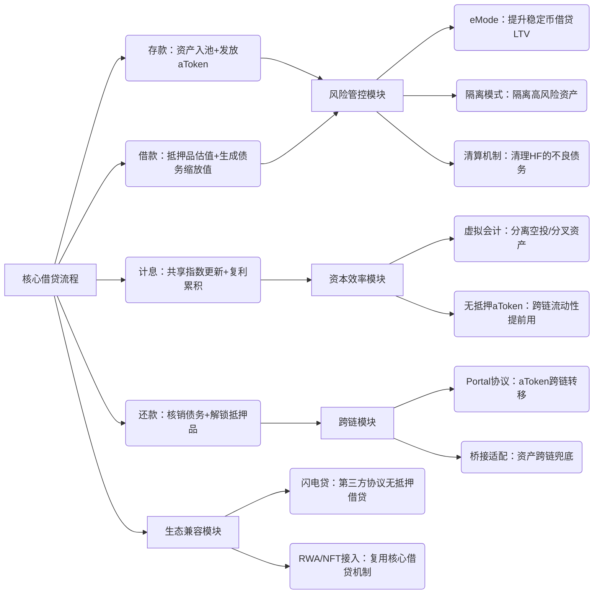

  

# 二、基于核心借贷：扩展的关键模块功能

核心借贷流程是基础，Aave V3 的升级亮点都围绕 “优化核心流程的风险、效率、兼容性” 展开，以下是各模块的具体作用（结合核心流程说明）：

## 风险管控模块：解决 “核心借贷的安全隐患”

核心借贷的最大风险是 “抵押品贬值导致坏账”，该模块通过 3 个机制兜底：

- **机制 1：分层风控（eMode / 效率模式）**：
  
  - 目标：eMode（Efficiency Mode）是专门针对 **“强相关、低波动资产”** 设计的 “高效借贷模式”—— 比如稳定币之间（USDC/DAI/USDT）、锚定同一资产的代币（wstETH/ETH、rETH/ETH），这类资产价格波动极小（稳定币波动＜1%，ETH 衍生品波动同步），无需过高的安全缓冲，因此可以提升 LTV（贷款价值比），让用户 “少抵押、多借款”。
  - 场景：用户借稳定币（USDC/DAI）时，切换到 eMode 模式；
  - 作用：LTV 从 80% 提升到 97%，清算阈值从 82% 提升到 98%，HF 更容易维持在 1 以上（如抵押 10,000 USDC，可借 9,700 DAI，HF=（10,000×98%）÷9,700≈1.01＞1）；
  
- **机制 2：隔离模式**：

  - 目标：隔离模式是专门针对 **“高波动、低流动性资产”** 设计的 “安全借贷模式”—— 比如小市值山寨币（如 ABC 代币）、新上线的小众资产，这类资产价格可能暴跌（甚至归零）、流动性差，若按通用规则纳入资产池，可能因抵押品贬值导致坏账，进而影响存款人资金安全。隔离模式的核心是：**让高风险资产 “单独成池、单独借贷”，不与低风险资产池互通，避免风险扩散**。
  - 场景：用户存入小市值山寨币（如 ABC 代币）作为抵押品；
  - 作用：ABC 单独成池，仅允许借入 USDC/DAI 等低风险稳定币，且 ABC 总供应上限 = 总 TVL 的 5%；
  - 目的：防止 ABC 价格暴跌（如归零）导致整个资产池坏账，隔离高风险资产的冲击。

- **机制 3：高效清算**：

  - 目标：在抵押品价格进一步下跌前，快速回收债务，避免坏账扩散（Aave V3 坏账率仅 0.02%，核心依赖此机制）。“高效” 体现在 3 点 —— **触发自动化、参与无门槛、奖励足够有吸引力**，确保不良债务能在几分钟内被清理。

  - 场景：ETH 价格从 2,500 USDC 跌到 2,400 USDC，用户抵押的 1 ETH 价值 = 2,400 USDC，HF=（2,400×82%）÷2,000=0.984＜1，触发清算；

  - 清算流程：
    1. 清算人（可是任何人）调用 `LiquidationManager.liquidate` 函数，偿还用户的 2,000 USDC 债务；
    2. 清算人获得奖励：抵押的 1 ETH 按 90% 折扣转让（即支付 2,000 USDC，获得 0.9 ETH，价值 2,160 USDC，盈利 160 USDC）+ 协议额外 1% 奖金（0.01 ETH）；
    3. 用户剩余抵押品：0.09 ETH 返还给用户，债务核销；

    

## 资本效率模块：解决 “核心借贷的资金闲置问题”

通过 “账实分离” 和 “流动性前置”，解决核心借贷中 “资产闲置” 和 “跨链效率低” 的痛点，让资金利用率从 V2 的 60% 提升至 85%。

- **机制 1：虚拟会计 ——“账实分离”，不占用借贷流动性**：
  
  - 目标：虚拟会计是 Aave V3 针对 “资产空投 / 分叉” 设计的 “账户分离机制”，核心是 **“将用户的‘借贷相关资产’（核心资产）和‘额外收益资产’（空投 / 分叉币）分开记账”**，避免额外资产占用资金池流动性，确保核心借贷流程不受影响。
  
  - 场景：用户存入 ETH 后，ETH 分叉产生 ETHW 空投，1 ETH 对应 1 ETHW；
  
  - 问题：若直接将 ETHW 计入 aETH 余额，会占用资产池流动性（用户提现时需支付 ETHW）；
  
  - 解决方案：`VirtualAccounting` 合约单独记录用户的 ETHW 余额（虚拟余额），用户可通过 `claimRewards` 函数单独提取 ETHW，不影响 aETH 的借贷功能（核心借贷的资金池仍为 ETH）。
  
- **机制 2：无抵押 aToken 铸造——“流动性前置”，跨链无需等**：

  - 目标：无抵押 aToken 铸造是 Aave V3 为 “跨链借贷” 设计的 “流动性预支机制”，核心是 **“在跨链资产到账前，提前为用户铸造‘无底层资产背书的 aToken’，用户可立即用于借款”**，避免跨链延迟导致的流动性闲置。

  - 场景：用户在以太坊存入 USDC，想在 Arbitrum 借款，但跨链桥转移 USDC 需 30 分钟；

  - 解决方案：
    1. 用户在以太坊销毁 aUSDC，发起跨链请求；
    2. Arbitrum 上的 `LendingPool` 直接铸造 “无抵押 aUSDC” 给用户（可立即用于借款）；
    3. 30 分钟后，跨链桥将以太坊的 USDC 转移到 Arbitrum 资产池，为无抵押 aUSDC 兜底；

  - 核心价值：避免跨链延迟导致的资金闲置，让流动性 “提前可用”，资金利用率从 V2 的 60% 提升到 85%。

    

## 跨链模块：解决 “核心借贷的链上孤岛问题”

核心借贷默认是 “单链闭环”（以太坊存款→以太坊借款），跨链模块让 “跨链借贷” 成为可能：

- **核心流程（以太坊存款→Arbitrum 借款）**：
  
  1. 用户在以太坊存入 10,000 USDC，获得 10,000 aUSDC；
  2. 调用 Portal.initiateCrossChain 函数，指定目标链（Arbitrum）和金额（10,000 aUSDC）；
  3. 以太坊 BridgeAdapter 销毁用户的 10,000 aUSDC，通过 Connext 桥向 Arbitrum 发送跨链消息；
  4. Arbitrum BridgeAdapter 收到消息，调用 LendingPool.mintUnbacked 铸造 10,000 无抵押 aUSDC 给用户；
  5. 用户用 Arbitrum 上的无抵押 aUSDC 作为抵押品，借款 8,000 USDC（LTV=80%）；
  6. 跨链桥批量转移 10,000 USDC 到 Arbitrum 资产池，无抵押 aUSDC 变为 “有资产背书” 的正常 aUSDC；

- **关键保障**：
  
  - 仅授权桥接协议可铸造无抵押 aToken，且额度≤该资产总 TVL 的 10%，避免过度铸造；
  
  - 多链参数统一：以太坊和 Arbitrum 上的 USDC 利率参数（R_base、U_opt 等）完全一致，用户跨链体验无差异。
  
  
  
  
## 生态兼容模块：让 “核心借贷成为 DeFi 基础设施”

核心借贷的资产池和风控逻辑，可被第三方协议直接复用，无需重复开发：

**示例 1：第三方协议调用闪电贷**：

- 场景：某套利协议想利用 “以太坊上 USDC 价格差” 套利，但缺少本金；

- 操作：继承 FlashLoanReceiverBase 基类，实现 executeOperation 函数，调用 Aave V3 的闪电贷功能；

- 流程：

  1. 套利协议发起闪电贷，借入 100 万 USDC（无抵押）；
  2. 同一交易内，用 100 万 USDC 在 Uniswap V2 买入低价资产，在 Uniswap V3 高价卖出，获利 5,000 USDC；
  3. 归还 100 万 USDC 本金 + 0.3% 手续费（3,000 USDC），净赚 2,000 USDC；

- 核心价值：Aave V3 提供 “无抵押、秒级到账” 的流动性，成为套利、清算等场景的核心工具（2025 年 Q2 闪电贷交易量达 142 亿美元）。
  

**示例 2：RWA 资产接入**：

- 场景：某机构发行代币化债券（如 US 国债代币化，代号 T-Bill），想接入 Aave V3 获得借贷流动性；
  
- 操作：
  
  1. 为 T-Bill 定制 PriceOracle 合约（通过链下银行报告 + 链上多签验证价格）；
  2. 通过治理提案将 T-Bill 接入 Horizon 市场，设置 LTV=70%、清算阈值 = 75%；
  3. 用户存入 T-Bill 作为抵押品，借入 USDC；存款用户获得 T-Bill 的借款利息分成；

- 核心价值：让传统金融资产（RWA）利用 Aave V3 的核心借贷机制获得流动性，打通 DeFi 与 TradFi。
  

# 三、核心模块逻辑关联图（清晰看懂各部分衔接）

# 四、核心总结：Aave V3 的逻辑本质

Aave V3 不是 “零散功能的堆砌”，而是 “以核心借贷为基石，层层扩展的模块化系统”：

1. 底层：核心借贷机制解决 “怎么安全、高效地实现去中心化借贷”，核心是 “aToken / 债务缩放值 + 共享指数” 的计息设计；
   
2. 中层：风险管控、资本效率模块解决 “核心借贷的安全隐患和闲置问题”，让借贷更稳健、资金更高效；
   
3. 上层：跨链、生态兼容模块解决 “核心借贷的场景局限”，让借贷突破单链限制，成为全生态的流动性底座。
   

所有模块都围绕 “核心借贷” 展开，没有脱离底层逻辑的独立功能 —— 这也是 Aave V3 能成为 DeFi 借贷标杆的关键：**先把最基础的借贷机制做到极致，再通过模块化扩展满足更多场景需求**。

