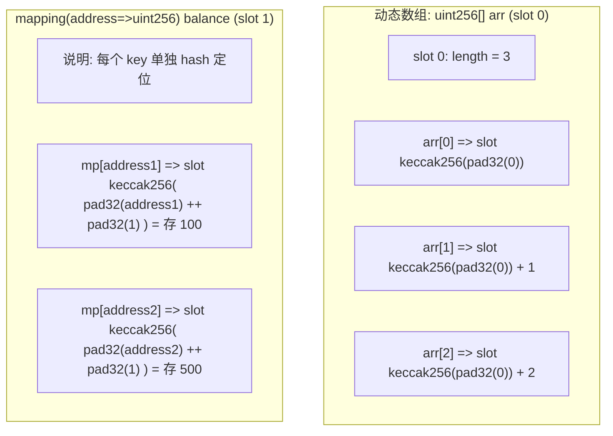
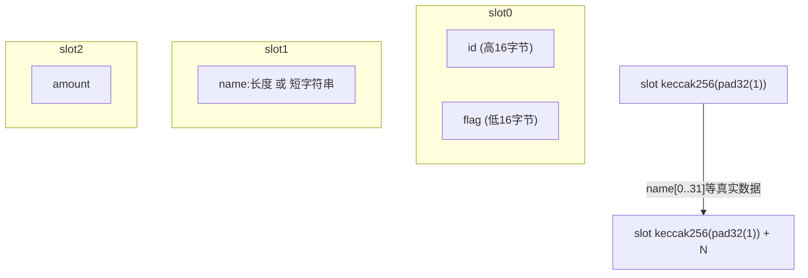
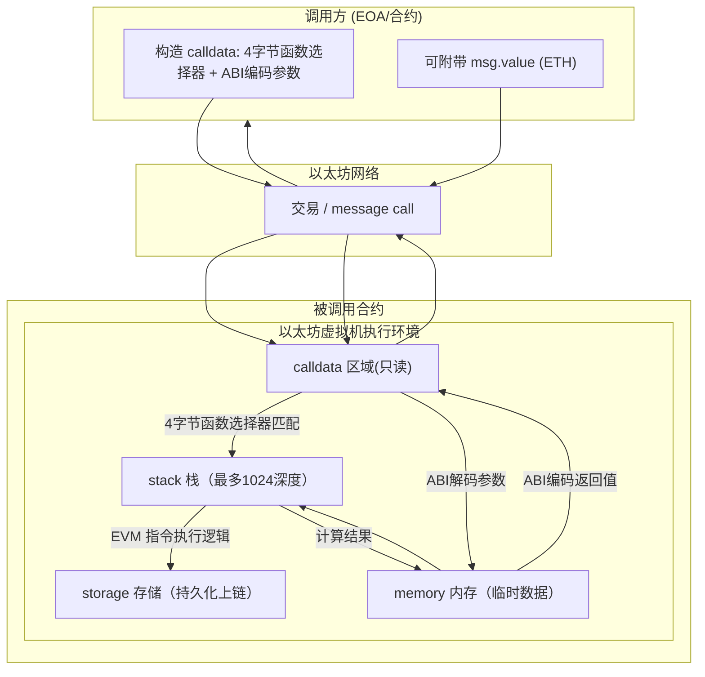
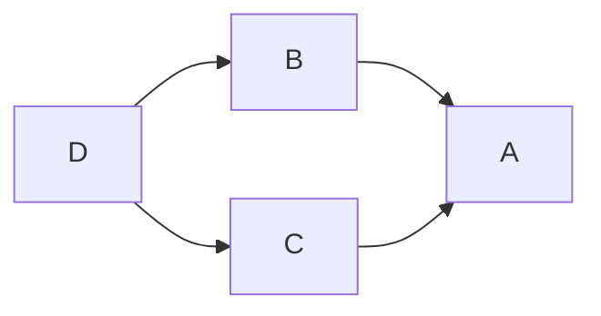
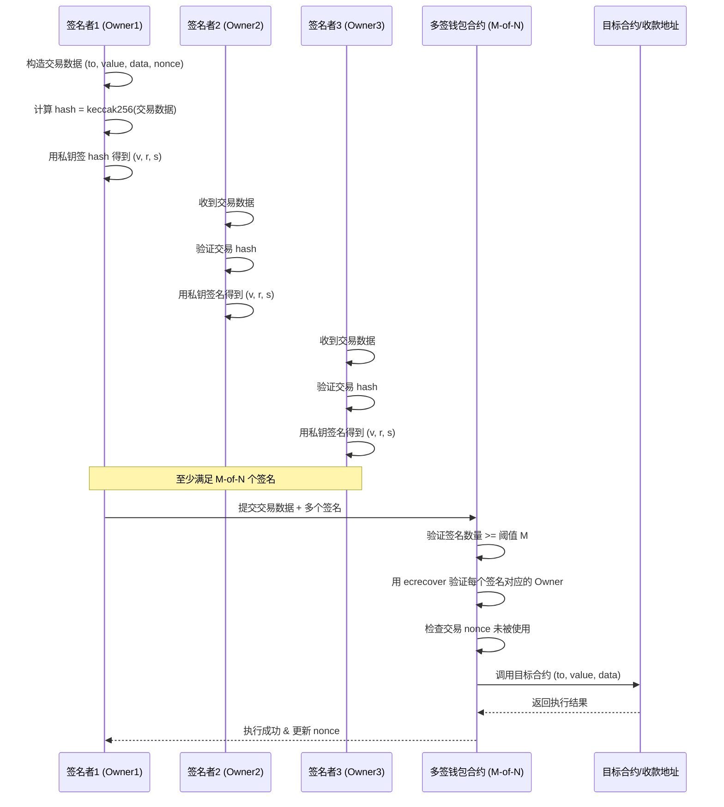

[TOC]


# 变量

```solidity
// SPDX-License-Identifier: GPL-3.0
pragma solidity >=0.4.0 <0.9.0;

contract SimpleStorage {
    uint storedData; // 状态变量
    // ...
}
```

## 存储位置（Data Location）

在以太坊智能合约（比如 Solidity）中，**状态变量的存储位置**直接影响到它的**生命周期、存储成本、修改方式**，以及**调用时的Gas消耗**。理解 `storage` / `memory` / `calldata` 对写合约非常重要。

| 存储位置   | 生命周期     | 存储位置           | 是否可修改 | Gas 成本                       | 常用场景                                  |
| ---------- | ------------ | ------------------ | ---------- | ------------------------------ | ----------------------------------------- |
| `storage`  | 合约生命周期 | 区块链永久存储     | 可修改     | 高（永久写入链上，需付存储费） | 状态变量、映射、结构体 等需持久保存的内容 |
| `memory`   | 函数调用期间 | 内存（临时）       | 可修改     | 相对低（仅执行期间临时占用）   | 临时变量、函数内计算、返回值              |
| `calldata` | 函数调用期间 | 不可修改的输入数据 | 不可修改   | 最低（直接读取外部传入数据）   | 外部函数的参数（尤其是数组、字符串）      |

| 特性       | `storage`              | `memory`           | `calldata`             |
| ---------- | ---------------------- | ------------------ | ---------------------- |
| 作用范围   | 全局（状态变量）       | 临时（函数内）     | 临时（输入参数，只读） |
| 生命周期   | 永久（合约存在即存在） | 函数调用结束即释放 | 函数调用结束即释放     |
| 是否可修改 | 可以                   | 可以               | 否                     |
| Gas 成本   | 高                     | 中                 | 低                     |
| 常用场景   | 状态变量               | 中间计算数据       | 外部函数的输入参数     |


## 值类型（Value Types）


* **整型**：`int` 、`uint` ，有符号和无符号。
    * 提供 `uint8, uint16, ..., uint256`，每次增加 8 位，总共从 8 位到 256 位。
    * 操作有：比较，位运算，移位，加、减法、乘法，除法，模运算，指数
* **布尔**：`bool` ， `true` 和  `false`。
* **枚举**：`enum` 。

    * 枚举不能有超过 256 个成员。

* **用户定义值类型**：


* 用户定义值类型使用 `type C is V` 定义，其中 `C` 是新引入类型的名称，`V` 必须是内置值类型（“基础类型”）。

* 函数 `C.wrap` 用于将基础类型转换为自定义类型。类似地，函数 `C.unwrap` 用于将自定义类型转换为基础类型。

* ```solidity
    // 使用用户定义值类型表示一个 18 位小数、256 位宽的定点类型。
    type UFixed256x18 is uint256;
    ```

* **地址（address）**：账户地址是一个 **20 字节（160 位）的值**，用于唯一标识一个账户（外部账户或合约账户）。

    - `address`：保存一个 20 字节的值（以太坊地址的大小）。

    - `address payable`：比 `address` 多了 `.transfer()` 和 `.send()`。

* **合约类型（Contract Types**）：在 Solidity 中定义了一个 `contract`，这个合约本身就形成了一种**新的类型**。
    * 和 `address` 不同的是，合约类型的变量除了可以存储地址，还**自动具备调用该合约中已定义函数的接口**。
    * 合约可以显式地转换为 `address` 类型和从 `address` 类型转换。
    * 只有当合约类型具有接收或可支付的回退函数时，才能显式转换为 `address payable` 类型。转换仍然使用 `address(x)` 进行。如果合约类型没有接收或可支付的回退函数，则可以使用 `payable(address(x))` 进行转换。


## 引用类型（Reference Types）

* 结构体（struct）：

    * 一个 `struct` 可以包含**多个字段**，可能字段之间的大小也不同、布局不规则。 Solidity 不会把整个结构体一次性当作单个值存储，而是将它的每个字段分别存储在连续的存储槽（storage slot）中。

    * 当你把一个结构体变量赋值给另一个时：

        - 如果数据位置是 `storage`，赋值的是**指向原始位置的引用**；
        - 如果是 `memory`，赋值的是**内存中的引用**；
        - 不会直接复制整个结构体的字段值（除非是 `storage` ↔ `memory` 或 `calldata` ↔ `memory` 的数据位置转换时才会做深拷贝）。

    * ```solidity
    pragma solidity ^0.8.0;
    
    contract StructRefExample {
        struct Person {
            string name;
            uint age;
        }
    
        Person public alice = Person("Alice", 20);
    
        function changeName() public {
            // p 是 alice 的 storage 引用
            Person storage p = alice;
            p.name = "Bob"; // 修改 p 会影响 alice
        }
    
        function getName() public view returns (string memory) {
            return alice.name;
        }
    }
    ```

* 数组：

    * **固定大小**为 `k` 且元素类型为 `T` 的数组类型写作 `T[k]`，**动态大小**的数组写作 `T[]`。
    * 动态数组可以改变长度（`push` / `pop`）；
    * `storage` 数组会直接修改区块链存储；
    * `memory` 数组是临时存在的，只在当前调用期间有效；
    * 可以使用 `new` 操作符创建动态长度的内存数组。 与存储数组不同，内存数组 **不能** 调整大小（例如，`.push` 成员函数不可用）。 你必须提前计算所需的大小或创建一个新的内存数组并复制每个元素。
    * 访问数组元素是 **O(1)** 时间复杂度；
    * 不支持直接删除中间元素（中间位置赋零值或手动移动元素）。

* 数组切片：
    * 数组切片是对数组连续部分的视图。 它们写作 `x[start:end]`，其中 `start` 和 `end` 是结果为 uint256 类型（或隐式可转换为它）的表达式。

## 映射类型（Mapping Type）


* 在 Solidity 中，**映射类型**（Mapping）相当于一种 **键值对（Key-Value）存储结构**，用来实现哈希表的功能。

* 变量声明语法 **`mapping(KeyType KeyName? => ValueType ValueName?) VariableName`** 。

* **只能存在于 `storage` 中**

    - `mapping` 不能声明为 `memory` 变量，也不能作为返回值直接返回（因为其内部存储无限大，无法遍历）。

* **所有可能的键值都存在**

    - 对于不存在的键，返回的是该值类型的**默认值**（`uint` 默认是 `0`，`bool` 默认是 `false`，引用类型默认空）。

* **不可遍历**

    - 不能直接获取 mapping 中的所有键或长度，因为 EVM 不存储键的集合。

* **存储方式是哈希定位**

    - 每个键值对不连续存储，而是通过 `keccak256` 哈希计算出唯一的存储槽位置。

        - $$
          计算公式 slot=keccak256(encode_key(key)∥p)
          $$

        - `key`：键值（会进行标准编码，例如 `uint256` 占 32 字节）

        - `p`：该 `mapping` 在合约存储变量列表中的槽编号（slot index）

        - `||`：字节拼接（concatenation）

    - 这样能够高效通过键定位到对应的存储位置，但不能反向获取所有键，因为 EVM 不保存“键列表”。

* **可迭代映射**

    * ```solidity
    // SPDX-License-Identifier: GPL-3.0
    pragma solidity ^0.8.8;
    
    struct IndexValue { uint keyIndex; uint value; }
    struct KeyFlag { uint key; bool deleted; }
    
    // 可迭代的映射
    struct itmap {
    		// 映射 (key, {keys数组下标，value})
        mapping(uint => IndexValue) data;
        // 数组 [{数组下标，是否使用}]
        KeyFlag[] keys;
        uint size;
    }
    
    type Iterator is uint;
    
    library IterableMapping {
        function insert(itmap storage self, uint key, uint value) internal returns (bool replaced) {
            uint keyIndex = self.data[key].keyIndex;
            self.data[key].value = value;
            if (keyIndex > 0)
                return true;
            else {
                keyIndex = self.keys.length;
                self.keys.push();
                self.data[key].keyIndex = keyIndex + 1;
                self.keys[keyIndex].key = key;
                self.size++;
                return false;
            }
        }
    
        function remove(itmap storage self, uint key) internal returns (bool success) {
            uint keyIndex = self.data[key].keyIndex;
            if (keyIndex == 0)
                return false;
            delete self.data[key];
            self.keys[keyIndex - 1].deleted = true;
            self.size --;
        }
    
        function contains(itmap storage self, uint key) internal view returns (bool) {
            return self.data[key].keyIndex > 0;
        }
    
        function iterateStart(itmap storage self) internal view returns (Iterator) {
            return iteratorSkipDeleted(self, 0);
        }
    
        function iterateValid(itmap storage self, Iterator iterator) internal view returns (bool) {
            return Iterator.unwrap(iterator) < self.keys.length;
        }
    
        function iterateNext(itmap storage self, Iterator iterator) internal view returns (Iterator) {
            return iteratorSkipDeleted(self, Iterator.unwrap(iterator) + 1);
        }
    
        function iterateGet(itmap storage self, Iterator iterator) internal view returns (uint key, uint value) {
            uint keyIndex = Iterator.unwrap(iterator);
            key = self.keys[keyIndex].key;
            value = self.data[key].value;
        }
    
        function iteratorSkipDeleted(itmap storage self, uint keyIndex) private view returns (Iterator) {
            while (keyIndex < self.keys.length && self.keys[keyIndex].deleted)
                keyIndex++;
            return Iterator.wrap(keyIndex);
        }
    }
    
    // 如何使用
    contract User {
        // 只是一个结构体来保存我们的数据。
        itmap data;
        // 将库函数应用于数据类型。
        using IterableMapping for itmap;
    
        // 插入数据
        function insert(uint k, uint v) public returns (uint size) {
            // 这调用了 IterableMapping.insert(data, k, v)
            data.insert(k, v);
            return data.size;
        }
    
        // 计算所有存储数据的总和。
        function sum() public view returns (uint s) {
            for (
                Iterator i = data.iterateStart();
                data.iterateValid(i);
                i = data.iterateNext(i)
            ) {
                (, uint value) = data.iterateGet(i);
                s += value;
            }
        }
    }
    ```


--------


## 存储布局（Storage Layout）


在 EVM 中，**每个合约的存储(Storage)** 是一个巨大的 **key-value 映射**：

- 键（key）：`uint256` 类型（slot 下标）
- 值（value）：**固定 32 字节**（256 bit）

Solidity 会根据你在源码中声明的**状态变量顺序和类型**，把它们依次映射到这些 slot 中。

> 存储布局（Storage Layout）就是**状态变量是如何排布到 slot 里的规则**。

--------

###  存储的基本规则

**顺序填充规则**

1. 状态变量按声明顺序分配 slot（不考虑可见性，`private` 也一样）
2. 每个 slot 32 bytes
3. 能够**打包**的小变量（`uint128`、`uint64`、`bool`、`address`等）会按顺序放进同一个 slot，直到满 32 bytes
4. 如果某变量大小超过剩余空间，则新开一个 slot


常见类型

| 类型               | 占用字节数 |
| ------------------ | ---------- |
| `uint256 / int256` | 32         |
| `address`          | 20         |
| `bool`             | 1          |
| `uint8`            | 1          |
| `uint128`          | 16         |

⚠ 注意：EVM 没有`byte`对齐概念，是 Solidity 编译器帮我们打包的。

--------

### 引用类型的存储

对于长度可变的类型（如 `string`、`bytes`、`array`、`mapping`）：

- **slot k**：先存储长度（固定 32 bytes）
- **数据本体**：存储在 `keccak256(k)` （及之后的连续 slot）位置

因此：

- 动态数组的元素从 `keccak256(slot)` 开始顺序排列

- `mapping` 的每个元素位置是：
  $$
  slot=keccak256(key ∥ p)
  $$


其中 *p* 是 mapping 在合约中的 slot 位置

--------


####  **以动态数组（ `uint256[]` ）为例**

```solidity
// SPDX-License-Identifier: MIT
pragma solidity ^0.8.0;
contract DemoStorage {
    uint256[] public arr; // slot0
}
```

1. **slot0**：存储 `arr` 的**长度**（元素个数）
2. **实际数组元素**：
    - 元素 `arr[0]` 存在 slot：`keccak256(slotIndex) + 0`
    - 元素 `arr[1]` 存在 slot：`keccak256(slotIndex) + 1`
    - 元素 `arr[2]` 存在 slot：`keccak256(slotIndex) + 2`

假设 `arr = [10, 20, 30]`：

```
slot0:  0x03                      // 长度 = 3
slotX:  0x0a                      // keccak256(0) → arr[0] = 10
slotX+1:0x14                      // arr[1] = 20
slotX+2:0x1e                      // arr[2] = 30
```

👉 所以读取数组时：

- 先在 `slot0` 读取长度
- 再用哈希 `keccak256(slot0索引) + 索引号` 定位到元素 slot

--------

#### string / bytes（动态长度）

```solidity
string public name; // slot0
```

- 对于 **短数据（≤31字节）** → **直接存放在 slot 中**（特殊编码：最后 1 byte 保存长度*2，末位 bit=1 表示内联）
- 对于 **长数据（>31字节）**：
    - slot0 存储数据长度（单位字节）
    - 实际数据存放在 `keccak256(slot0索引)` 开始的位置，按 32 字节对齐分段。

```solidity
string public name = "HelloWorld"; // 长度 10
```

- slot0: `0x0a` （十进制 10）
- slotX: 存放 实际 ASCII 编码的 `"HelloWorld"`（padded）


--------

####  mapping 存储方式（重点）

```solidity
mapping(address => uint256) public balance; // slot0
```

- `mapping` 没有长度信息（不可遍历）

- 每个键值对的存储位置：
  $$
  slot=keccak256(encode(key)∥encode(slotIndex))
  $$
  这里的 ∣∣ 表示拼接。

```solidity
balance[0x1111...] = 100;
```

- key = `0x1111...` 地址补齐为 32 字节
- slotIndex = 0（`balance` 变量位置） 补齐 32 字节
- 拼接后做 `keccak256` → 这个哈希位置就是该 key 的值的存储槽

这样：

- `mapping` 访问时，不能直接通过 slot 连续读取，只能通过 key 定位。
- 这也是 Solidity mapping **不能直接遍历**的原因。




--------

#### 结构体存储

```solidity
pragma solidity ^0.8.0;
contract Demo {
    struct MyStruct {
        uint128 id;       // 占 16 字节
        uint128 flag;     // 占 16 字节，可与 id 打包
        string name;      // 动态字段，占一个 slot 存长度/短数据
        uint256 amount;   // 占 32 字节
    }
    MyStruct public data; // slot 从 0 开始
}
```




- `slot0` 内部两个字段打包，因为 `uint128 + uint128 = 32` 字节
- `string name` 在 `slot1` 只存**长度或短数据**
- 真实 name 数据存放在 `keccak256( pad32(slot1) )` 之后的连续 slot
- `amount` 在 slot2 独占存放

--------

# 可见性

- `external`：只能从合约外部或使用 `this.func(...)` 以外部方式调用，属于外部 ABI。
- `public`：既可以外部调用（会生成 ABI），也可以内部调用（通过内部跳转）。
- `internal`：只能在本合约及其派生合约中调用，不属于外部 ABI。
- `private`：只能在本合约中调用（派生合约不能访问），也不属于外部 ABI。


# 函数（function）

函数定义的一般形式

```solidity
function 函数名(参数列表) 可见性 状态修饰符 返回值定义 {
    // 函数体
}
```

```solidity
// SPDX-License-Identifier: GPL-3.0
pragma solidity >=0.7.1 <0.9.0;

contract SimpleAuction {
    function bid() public payable { // 函数
        // ...
    }
}

// 在合约外部定义的辅助函数
function helper(uint x) pure returns (uint) {
    return x * 2;
}
```


## 参数/返回值

* **函数参数**：

    * 参数类型：

        * **值类型**：`uint`, `bool`, `address`, `bytes32` 等 — 按值传递（copy）

        * **引用类型**：`array`, `struct`, `mapping` — 需要指定数据位置（`storage`/`memory`/`calldata`）

    * 参数位置（对于引用类型参数）

        * `storage`：变量指向合约存储中的数据（修改会影响原数据）

        * `memory`：传入时拷贝到内存（修改不会影响原数据，调用结束即销毁）
        * `calldata`：只读内存，适用于 `external` 函数参数（节省 gas）

    * ```solidity
    pragma solidity ^0.8.0;
    
    contract ParamExample {
        uint[] public arr = [1, 2, 3];
    
        // 引用类型参数需指明数据位置
        function modifyStorage(uint[] storage myArr) internal {
            myArr[0] = 100; // 修改会直接影响 arr
        }
    
        function modifyMemory(uint[] memory myArr) public pure {
            myArr[0] = 500; // 只是修改临时内存
        }
    
        function test() public {
            modifyStorage(arr); // 会改 arr[0] = 100
        }
    }
    ```

* **函数返回值**：

    * 函数可以返回 **值类型**、**引用类型** 甚至 **多个返回值**。

    * ```solidity
    // SPDX-License-Identifier: GPL-3.0
    pragma solidity >=0.4.16 <0.9.0;
    
    contract Simple {
        function arithmetic(uint a, uint b)
            public
            pure
            returns (uint sum, uint product)
        {	
        		// 可以显式地赋值给返回变量
            sum = a + b;
            product = a * b;
        }
    }
    ```

    * ```solidity
    // SPDX-License-Identifier: GPL-3.0
    pragma solidity >=0.4.16 <0.9.0;
    
    contract Simple {
        function arithmetic(uint a, uint b)
            public
            pure
            returns (uint sum, uint product)
        {
            return (a + b, a * b);
        }
    }
    ```


## 函数调用（Calling）

### 内部调用（Internal Call）

- 在**同一个合约内**直接调用，或从继承合约中调用。
- 编译器会使用 **`JUMP` 指令**（内部跳转），不消耗额外消息调用（message call）的 gas。
- **调用方式**：直接写函数名。

* ```solidity
  function foo() internal pure returns(uint) {
      return 1;
  }
  
  function bar() public pure returns(uint) {
      return foo(); // 内部调用
  }
  ```

* 仍然应该**避免过度递归**，因为每个内部函数调用至少使用一个栈槽，而可用的栈槽只有 1024 个。


### 外部调用（External Call）

- 从合约外部调用函数。

- 如果在合约内部想触发一次外部调用，需要使用 `this.函数名(...)`（会触发完整的 EVM message call，gas 更贵）。

- 外部调用是通过**消息发送**实现的，实际是发起一次交易或合约间调用。

- ```solidity
  function baz() public view returns(uint) {
      return this.foo(); // 外部调用，即使 foo() 是 public
  }
  ```

### 跨合约调用（Contract-to-Contract Call）

- 先获取目标合约的地址，然后通过合约实例来调用它的函数。

- 如果是 `payable` 函数，可以在调用时附带 `value` 发送 ETH。

- ```solidity
  contract A {
      function getNumber() public pure returns(uint) {
          return 42;
      }
  }
  
  contract B {
      function callGetNumber(address contractA) public view returns(uint) {
          A a = A(contractA);  // 获取合约实例
          return a.getNumber(); // 调用 A 的函数
      }
  }
  ```

### 特殊调用

#### `.call()` 低级调用

- 用于未知 ABI 的调用或需要传递数据 payload。

- 返回 `(bool success, bytes memory data)`。

- ```solidity
  (bool ok, bytes memory res) = target.call(abi.encodeWithSignature("transfer(address,uint256)", to, amount));
  ```


#### `.delegatecall()`

- 在调用者的上下文执行目标合约代码（storage、msg.sender 保持不变）。
- 用于代理模式（proxy）。


#### `.staticcall()`

- 和 `.call()` 类似，但强制不能修改状态。


### 函数调用执行时的数据流示意图




## 函数修改器（modifier）

**函数修改器（modifier）** 是 Solidity 提供的一种语法机制，用于在函数执行前（或执行过程中）插入额外的逻辑。 常用于：

- 权限控制（如 `onlyOwner`）
- 输入参数验证
- 函数调用条件判断（例如是否解锁、是否到期）
- 自动执行某些通用逻辑（记录时间、事件等）
- 修改器 `modifier`  是合约的可继承属性，可以被派生合约重写 ，但只有在标记为 `virtual` 的情况下。

> **注意**：modifier 不是函数，但它可以像函数一样写逻辑，并通过 `_` 占位符决定目标函数体的执行位置。

```solidity
modifier 修改器名称(可选参数) {
    // 前置逻辑
    _;
    // （可选）后置逻辑
}
```

```solidity
// SPDX-License-Identifier: GPL-3.0
pragma solidity >=0.7.1 <0.9.0;

contract owned {
    constructor() { owner = payable(msg.sender); }
    address payable owner;

    // 该合约仅定义了一个修改器，但未使用它：它将在派生合约中使用。
    // 函数体插入在修改器定义中的特殊符号 `_;` 出现的位置。
    // 这意味着如果所有者调用此函数，则函数将被执行，否则将抛出异常。
    modifier onlyOwner {
        require(
            msg.sender == owner,
            "Only owner can call this function."
        );
        _;
    }
}

contract priced {
    // 修改器可以接收参数：
    modifier costs(uint price) {
        if (msg.value >= price) {
            _;
        }
    }
}

contract Register is priced, owned {
    mapping(address => bool) registeredAddresses;
    uint price;

    constructor(uint initialPrice) { price = initialPrice; }

    // 这里也必须提供 `payable` 关键字，否则该函数将自动拒绝所有发送给它的以太币。
    function register() public payable costs(price) {
        registeredAddresses[msg.sender] = true;
    }

    // 该合约从 `owned` 合约继承了 `onlyOwner` 修改器。
    // 因此，调用 `changePrice` 仅在存储的所有者进行调用时才会生效。
    function changePrice(uint price_) public onlyOwner {
        price = price_;
    }
}

contract Mutex {
    bool locked;
    modifier noReentrancy() {
        require(
            !locked,
            "Reentrant call."
        );
        locked = true;
        _;
        locked = false;
    }

    /// 此函数受互斥锁保护，这意味着来自 `msg.sender.call` 的重入调用不能再次调用 `f`。
    /// `return 7` 语句将 7 赋值给返回值，执行修改器中的语句 `locked = false`。仍会执行。
    function f() public noReentrancy returns (uint) {
        (bool success,) = msg.sender.call("");
        require(success);
        return 7;
    }
}
```


## 状态可变性

**状态可变性修饰符**描述了函数**是否可以读取或修改区块链上的状态**。

| 修饰符         | 是否可读状态变量 | 是否可改状态变量 | 是否可接收 ETH | 常见场景           |
| -------------- | ---------------- | ---------------- | -------------- | ------------------ |
| `pure`         | ❌                | ❌                | ❌              | 仅依赖输入参数计算 |
| `view`         | ✅                | ❌                | ❌              | 查询链上数据、只读 |
| 无修饰（默认） | ✅                | ✅                | ❌              | 修改状态变量       |
| `payable`      | ✅/❌              | ✅/❌              | ✅              | 接收和转账 ETH     |

* `pure`

    * 不能读取合约的**链上状态变量**

    * 不能修改合约的**链上状态变量**

    * 只能依赖传入参数 & 内部计算

    * gas 消耗最低

    * 如果在 pure 函数中读取/修改状态变量，会编译报错

    * ```solidity
    function add(uint a, uint b) public pure returns(uint) {
        return a + b; // 纯计算，不依赖链上数据
    }
    ```

* `view`

    * 可以**读取**状态变量

    * 不可以修改状态变量

    * 不会触发区块链状态变化（链外调用不消耗 gas）

    * 如果在 view 函数中写入状态，会编译报错

    * ```solidity
    uint public total;
    
    function getTotal() public view returns(uint) {
        return total; // 读取允许
    }
    ```

* 无修饰（默认）

    * 可读可写状态变量

    * 调用会触发交易并消耗 gas（链上执行）

    * 用于修改合约状态的场景

    * ```solidity
    uint public counter;
    
    function increment() public {
        counter += 1; // 修改状态
    }
    ```

* `payable`

    * 表示该函数可以接收以太币（Ether）

    * 可结合上面任意状态可变性（但通常和修改状态一起用）

    * 调用时必须使用 `payable(地址).函数名{value: 金额}()` 发ETH

    * 如果调用 payable 函数不转 ETH，依然能执行逻辑

    * ```solidity
    function deposit() public payable {
        // msg.value 表示转入的 Wei 数量
    }
    ```


## 特殊函数

| 特殊函数                          | 版本支持 | 自动触发条件                                      | 主要用途                          |
| --------------------------------- | -------- | ------------------------------------------------- | --------------------------------- |
| **`constructor`**                 | 所有版本 | 部署合约时                                        | 初始化状态变量 / 权限配置         |
| **`receive()`**                   | ≥0.6.0   | 接收 ETH 且 `calldata` 为空                       | 接收ETH，不处理数据               |
| **`fallback()`**                  | 所有版本 | 调用不存在的函数 或 `calldata` 不为空但无匹配函数 | 处理未知调用 / 接收ETH / 代理转发 |
| **`function default()`**          | <0.6.0   | 调用不存在的函数                                  | 老版本 fallback                   |
| **`selfdestruct()`**              | 所有版本 | 调用时立即销毁合约                                | 删除合约并转移剩余 ETH            |
| **`receive` + `fallback` 双函数** | ≥0.6.0   | 按接收ETH/数据情况选择                            | 精细化处理ETH接收/其他调用        |


### 接收ETH函数 `receive()`

- Solidity 0.6.0 新增
- 只有一个用途 → **接收以太币转账（无数据）**
- 必须加 `external payable`
- 每个合约最多一个 `receive` 函数
- 如果收到 ETH 且调用数据为空，会触发 `receive()`
- 如果不存在 `receive()`，则尝试调用 `fallback()`

```solidity
receive() external payable {
    // 只处理 ETH 转账，不带数据
}
```


### 回退函数 `fallback()`

- 在以下情况自动执行：
    1. 调用合约中不存在的函数
    2. 或直接发交易到合约地址，并且 `calldata` 非空（即有数据）
- 必须声明为 `external`（可加 `payable` 来接收ETH）
- 常用于：
    - 代理合约（delegatecall转发未知函数调用）
    - 记录异常调用
    - 接收带数据的 ETH 转账

```solidity
fallback() external payable {
    // 可以接收 ETH 并记录调用信息
}
```

#### `receive()` 与 `fallback()` 触发顺序

在 Solidity ≥ 0.6.0 中，ETH 转账相关调用逻辑：

| 交易类型          | 是否有 `receive()` | 是否 `calldata` 为空 | 调用的函数                     |
| ----------------- | ------------------ | -------------------- | ------------------------------ |
| 发送ETH（无数据） | 有                 | 是                   | `receive()`                    |
| 发送ETH（无数据） | 无                 | 是                   | `fallback()`（如果 `payable`） |
| 调用不存在的函数  | -                  | -                    | `fallback()`                   |
| 发送ETH带数据     | 有/无              | 否                   | `fallback()`（如果 `payable`） |


> * 当合约被发送 ETH 且 calldata 为空时：
    >   * 若合约实现了 `receive()`，则调用 `receive()`。
>   * 若没有 `receive()`，但实现了 `fallback()` 且 `fallback` 是 payable，则调用 `fallback()`。
>   * 若两者都不存在或都不可接收 ETH（非 payable），交易会 revert（失败）。
> * 如果 calldata 非空（即发送方带有数据），则不会触发 `receive()`，而是走 `fallback()`（如果存在）——不论 value 是否为 0。
> * 通过合约间的低级调用（`call{value:...}("")`、`send`、`transfer`）或外部账号发交易（data 为空）都能触发 `receive()`（前提是 calldata 为空）。
> * 注意：使用 `selfdestruct` 给目标合约增加余额时，不会执行目标合约的 `receive`/`fallback`（balance 直接增加，不触发代码执行）。
> * gas：`transfer`/`send` 会只转发 2300 gas（可能不足以执行复杂逻辑），而 `call{value:...}("")` 默认转发剩余 gas（更灵活但需注意重入风险）。

```solidity
// SPDX-License-Identifier: MIT
pragma solidity ^0.8.0;

contract Receiver {
    event Log(string func, address indexed sender, uint256 value, bytes data);

    // 当 calldata 为空且有 ETH 时触发
    receive() external payable {
        emit Log("receive", msg.sender, msg.value, "");
    }

    // 当 calldata 非空 或 未匹配函数 或 fallback 被显式调用时触发
    fallback() external payable {
        emit Log("fallback", msg.sender, msg.value, msg.data);
    }

    function getBalance() external view returns (uint256) {
        return address(this).balance;
    }
}

contract Sender {
    // 直接用 transfer
    function sendWithTransfer(address payable to) external payable {
        to.transfer(msg.value);
    }

    // 用 send
    function sendWithSend(address payable to) external payable {
        bool ok = to.send(msg.value);
        require(ok, "send failed");
    }

    // 用 call，空 data（会触发 receive，若有）
    function sendWithCallEmpty(address payable to) external payable {
        (bool ok, ) = to.call{value: msg.value}("");
        require(ok, "call empty failed");
    }

    // 用 call，带上非空 data（会触发 fallback）
    function sendWithCallData(address payable to) external payable {
        // 发送带数据的调用，Receiver 没有对应函数，会触发 fallback
        (bool ok, ) = to.call{value: msg.value}(abi.encodeWithSignature("nonexistent()"));
        require(ok, "call data failed");
    }
}
```

### 销毁合约（`selfdestruct()`）

- 调用后：
    - 删除合约字节码（gas refund）
    - 将剩余 ETH 转给指定地址
- 不可恢复
- 在 Solidity 0.8.18 开始被标记为 **deprecated**，因为它会永久删除合约代码，破坏可预测性

```solidity
function destroy(address payable recipient) public {
    require(msg.sender == owner, "Not owner");
    selfdestruct(recipient);
}
```


# 全局变量 & 全局函数（API）

## 区块和交易相关的全局变量

| 变量               | 类型              | 说明                          |
| ------------------ | ----------------- | ----------------------------- |
| `block.number`     | `uint`            | 当前区块号                    |
| `block.timestamp`  | `uint`            | 当前区块的时间戳（秒）        |
| `block.coinbase`   | `address payable` | 当前区块矿工地址              |
| `block.difficulty` | `uint`            | 当前区块难度（PoS后含义不同） |
| `block.gaslimit`   | `uint`            | 当前区块的 gas 限制           |
| `gasleft()`        | `uint256`         | 剩余 gas 数量                 |
| `msg.sender`       | `address`         | 当前调用者地址                |
| `msg.value`        | `uint`            | 本次调用发送的 Wei 数量       |
| `msg.data`         | `bytes`           | 完整调用数据（calldata）      |
| `msg.sig`          | `bytes4`          | 函数选择器（calldata前4字节） |
| `tx.origin`        | `address`         | 发起交易的原始账户地址        |

## 地址相关的成员

Solidity 的 `address` 类型自带一些函数（特别是 `address payable` 可以转账）：

| 成员函数 / 属性                     | 说明                               |
| ----------------------------------- | ---------------------------------- |
| `<address>.balance`                 | 返回该地址的 ETH 余额（单位：Wei） |
| `<address>.transfer(uint amount)`   | 转账指定 Wei（失败抛异常）         |
| `<address>.send(uint amount)`       | 转账，返回 bool，失败不会 revert   |
| `<address>.call(bytes memory)`      | 低级调用（返回 `success, data`）   |
| `<address>.delegatecall(bytes mem)` | 低级委托调用                       |
| `<address>.staticcall(bytes mem)`   | 低级静态调用（不能修改状态）       |

## 哈希、数学、编码相关的全局函数

| 函数                                                     | 返回值类型 | 说明                            |
| -------------------------------------------------------- | ---------- | ------------------------------- |
| `keccak256(bytes memory)`                                | `bytes32`  | Keccak-256 哈希                 |
| `sha256(bytes memory)`                                   | `bytes32`  | SHA-256 哈希                    |
| `ripemd160(bytes memory)`                                | `bytes20`  | RIPEMD-160 哈希                 |
| `ecrecover(bytes32 hash, uint8 v, bytes32 r, bytes32 s)` | `address`  | 从椭圆曲线签名中恢复公钥地址    |
| `addmod(uint x, uint y, uint k)`                         | `uint`     | `(x + y) % k`（防溢出）         |
| `mulmod(uint x, uint y, uint k)`                         | `uint`     | `(x * y) % k`（防溢出）         |
| `blockhash(uint blockNumber)`                            | `bytes32`  | 获取过去256个区块中某区块的哈希 |
| `type(T).min` / `type(T).max`                            | 与类型相关 | 获取某数据类型的最小值/最大值   |

##  ABI 编码/解码相关函数

| 函数                                    | 说明                   |
| --------------------------------------- | ---------------------- |
| `abi.encode(...)`                       | ABI 编码，返回 `bytes` |
| `abi.encodePacked(...)`                 | 紧凑ABI编码（拼接）    |
| `abi.encodeWithSelector(selector, ...)` | 用指定选择器编码       |
| `abi.encodeWithSignature(sig, ...)`     | 用函数签名编码         |
| `abi.decode(bytes memory, (...types))`  | ABI 解码               |

## 错误处理 & gas 信息

| `assert(condition)`       | 不满足则 revert 并消耗剩余 gas（用于检测不变量）  |
| ------------------------- | ------------------------------------------------- |
| `require(condition, msg)` | 条件不满足则 revert，返还剩余 gas（用于输入校验） |
| `revert(msg)`             | 主动触发回滚                                      |
| `gasleft()`               | 返回当前剩余 gas                                  |

## 实用全局常量

| 常量          | 值/类型        | 说明                   |
| ------------- | -------------- | ---------------------- |
| `type(T).min` | 各类型最小值   | 如 `type(uint256).min` |
| `type(T).max` | 各类型最大值   | 如 `type(uint256).max` |
| `this`        | 当前合约地址   | `address(this)`        |
| `super`       | 调用父合约实现 | 继承结构中使用         |


# 进阶

## **回退与错误处理机制**

### 回退（Revert）的含义

在 EVM 中，如果交易执行遇到错误并 **回退（revert）**：

- 当前交易所产生的**所有状态更改会被撤销**
- 剩余 **未使用的 gas 会退还**（`assert` 会消耗完 gas）
- 可以选择返回错误信息（`reason string`）

常见触发回退的情况：

1. 手动调用 `revert()` / `require()` / `assert()`
2. `transfer()` / `send()` / 调用函数失败
3. 调用不存在的函数，进入 `fallback()` 并 `revert`
4. `out-of-gas`、`assert(false)` 等严重错误

### 错误处理的主要工具

* `require(condition, message)`

    * **逻辑检查/输入验证**

    * 条件不满足则回退，并**退还剩余 gas**

    * 可带错误原因字符串（客户端能获取）

    * 常用于外部输入、权限验证、状态判断

    * ```solidity
    function transfer(uint amount) public {
        require(balance[msg.sender] >= amount, "Not enough funds");
        balance[msg.sender] -= amount;
        balance[receiver] += amount;
    }
    ```

* `revert(message)`

    * 强制回退交易

    * 可以用于复杂条件判断中提前退出

    * 支持自定义错误信息

    * ```solidity
    if(balance[msg.sender] < amount) {
        revert("Insufficient funds");
    }
    ```

* `assert(condition)`

    * `assert` 函数会创建一个类型为 `Panic(uint256)` 的错误。 如果发生这种情况，则你的合约中存在一个错误，你应当修复它。

    * 通常不用于业务逻辑检查， 应**仅用于测试内部错误**，并检查不变式。正常工作的代码不应创建 Panic，即使在无效的外部输入下也不应如此。

    * 条件为假，则回退并**消耗所有 gas**（0.8+可能退还未用 gas）

    * ```solidity
    assert(totalSupply == balances[msg.sender] + balances[receiver]);
    ```


* `try/catch`

    * **只能用于**：

        * **外部合约调用**（非 `internal` 调用）
        * **`new` 部署合约**

    * 捕获块有 4 种形式：

        1. **空 catch**（不带参数） → 捕获所有异常
        2. `catch Error(string memory reason)` → 捕获 `require` / `revert` 抛出的错误字符串
        3. `catch Panic(uint errorCode)` → 捕获 `assert`、算术溢出等导致的 Panic 异常（Solidity 0.8+）
        4. `catch (bytes memory lowLevelData)` → 捕获底层 call 返回的数据（有时是编码后的错误）

    * ```solidity
    // SPDX-License-Identifier: GPL-3.0
    pragma solidity >=0.8.1;
    
    interface DataFeed { function getData(address token) external returns (uint value); }
    
    contract FeedConsumer {
        DataFeed feed;
        uint errorCount;
        function rate(address token) public returns (uint value, bool success) {
            require(errorCount < 10);
            // try 关键字后必须跟一个表示外部函数调用或合约创建 (new ContractName()) 的表达式
            try feed.getData(token) returns (uint v) {
                return (v, true);
            // 如果错误是由 revert("reasonString") 或 require(false, "reasonString") （或导致此类异常的内部错误）引起的
            } catch Error(string memory reason) {
                errorCount++;
                return (0, false);
            // 如果错误是由 panic 引起的，即由失败的 assert、除以零、无效数组访问、算术溢出等引起的
            } catch Panic(uint errorCode) {
                errorCount++;
                return (0, false);
            // 如果错误签名不匹配任何其他子句，或者在解码错误消息时发生错误，或者如果没有提供错误数据
            } catch (bytes memory lowLevelData) {
                errorCount++;
                return (0, false);
            }
        }
    }
    ```


###  Panic 错误码

Panic 是 Solidity 0.8+ 内置的、用于严重错误的编码：

- `0x01`：`assert` 失败
- `0x11`：算术溢出/下溢
- `0x12`：除以 0
- `0x21`：转换溢出
- `0x31`：数组越界
- `0x32`：`pop` 空数组
- `0x41`：`memory` 溢出
- `0x51`：调用 `zero-initialized internal function`


###  自定义错误（Custom Error）0.8+ 新特性

- Gas 更省，比字符串错误信息节约大量存储成本
- 可携带参数返回给前端解码
- 推荐**公共接口定义**时使用

```solidity
error NotEnoughFunds(uint requested, uint available);

function withdraw(uint amount) public {
    if(amount > balance[msg.sender]) {
        revert NotEnoughFunds(amount, balance[msg.sender]);
    }
}
```

好处：

- `bytes4` 选择器 + ABI 编码参数，比 reason string 更小
- 在调用方（如 Web3.js、ethers.js）可解码错误类型和参数


## 事件（**Event**）

**Solidity 中的事件（Event）**，这是智能合约里非常重要的“日志记录机制”，主要用于 **链上数据通知链下应用**（如 DApp 前端、区块浏览器监听等）。


### 事件的定义

在 Solidity 中，**事件**（`event`）是 EVM 的 **日志功能（Log）** 的高级封装：

- **链上存储**：事件不会保存在合约状态变量中，而是存储到交易的日志（logs）里
- **链下监听**：DApp、Web3.js、Ethers.js 可以订阅这些事件
- **不可访问**：事件数据写进 `logs`，EVM 本身无法读取（只能链下读取）


### 基本语法


```solidity
event EventName(
    dataType indexed param1,
    dataType param2
);

emit EventName(arg1, arg2);
```

- `event`：声明事件
- `emit`：触发事件（Solidity 0.4.21+ 推荐）
- `indexed`：将参数编入事件“topics”，最多 3 个 `indexed` 参数，可以用于链下快速过滤查询


```solidity
pragma solidity ^0.8.0;

contract EventDemo {
    event Transfer(address indexed from, address indexed to, uint256 amount);
    
    mapping(address => uint256) public balance;
    
    function transfer(address to, uint256 amount) public {
        require(balance[msg.sender] >= amount, "Not enough balance");
        balance[msg.sender] -= amount;
        balance[to] += amount;
        
        emit Transfer(msg.sender, to, amount); // 触发事件
    }
}
```

### 索引参数（indexed）

- 最多 3 个字段可以加 `indexed`
- `indexed` 参数会进入 **topic**，成为可索引的日志索引值
- 在链下监听时，可以用特定地址或某个值做过滤
- 不加 `indexed` 的参数，只能通过读取事件完整数据来获取


```solidity
event Purchase(address indexed buyer, uint indexed productId, uint price);

emit Purchase(msg.sender, 123, 5 ether);
```

监听（Ethers.js）：

```js
contract.on("Purchase", (buyer, productId, price) => {
  console.log(buyer, productId.toString(), price.toString());
});
```

按条件查询：
```js
contract.filters.Purchase(userAddress, null);
```


### 匿名事件（anonymous）不推荐

- 默认事件第一个 topic 是事件签名 `keccak256("EventName(type1,type2,...)")`
- 如果用 `anonymous` 修饰，事件签名不会作为第一个 topic
- 匿名事件最多有 **4 个 indexed 参数**（比普通事件多 1 个）
- 会降低链下识别便利性，但可节省部分 gas

```solidity
event LogData(address indexed sender, uint value) anonymous;
```


### 事件设计最佳实践表

| 分类               | 最佳实践                                                     | 原因与好处                                                   | 示例                                                         |
| ------------------ | ------------------------------------------------------------ | ------------------------------------------------------------ | ------------------------------------------------------------ |
| **命名规范**       | 事件名称采用 **动宾结构 + 首字母大写**（PascalCase），使用过去时态（如 Completed、Transferred） | 与以太坊 ERC 标准(如 ERC20 Transfer、Approval) 一致，便于前端和区块浏览器识别 | `ItemListed`、`OwnershipTransferred`                         |
| **参数命名**       | 参数名遵循 **lowerCamelCase**；确保可读性且含义明确          | 方便链下直接理解参数含义，减少二次查阅                       | `event Transfer(address indexed from, address indexed to, uint256 value)` |
| **indexed 使用**   | 给**常用于查询过滤的字段**添加 `indexed`（如地址、ID），最大 3 个；避免为大数组或复杂结构体添加索引 | 提升链下检索速度（使用 topics 索引），避免 gas 成本浪费      | `event Transfer(address indexed from, address indexed to, uint256 value)` |
| **anonymous 使用** | 几乎不推荐使用，除非：1）无需事件名主题 topic；2）确保链下能通过 ABI 解析事件 | 保留事件的可识别性（非匿名事件便于区块浏览器索引、调试）     | `event RawData(bytes32 indexed hash) anonymous`              |
| **数据类型选择**   | 优先使用 `uint256`（默认数值类型）、`address`、`bytes32` 等固定长类型；不在事件中放动态array / mapping | 固定长更省 gas，topics 查询友好                              | `event OrderCreated(uint256 indexed orderId, address indexed buyer)` |
| **减少数据冗余**   | 不重复记录可从其他参数/链上状态推导的值                      | 减少 gas 消耗、事件日志大小                                  | 如果 `orderId` 可推导，就不要再额外存 hash                   |
| **顺序安排**       | 将常检索字段（indexed）放前面，非 indexed 字段放后           | 方便链下写索引过滤，Gas 成本优化                             | `event Listed(address indexed seller, uint indexed tokenId, uint price)` |
| **使用场景设计**   | 每个核心状态变更都应有对应事件；避免合并多种复杂语义到一个事件中 | 链下监听更精准；代码阅读性更高                               | 拆分成 `ItemListed`、`ItemSold` 而非通用 `ItemChanged`       |
| **错误事件**       | 尽量避免直接 emit “失败事件”代替 revert；错误应通过 `require/revert` 返回 | 保证合约状态安全，事件日志仅用于**成功状态变更**             | × `emit FailedTx(id);` → √ `require(...)`                    |
| **安全日志**       | 敏感操作（权限授予、资产转移）必须加事件                     | 链下审计与安全监控用                                         | `event RoleGranted(bytes32 indexed role, address indexed account, address indexed sender)` |
| **事件扩展性**     | 为以后可能的新增字段保留空间，可以通过添加新事件而不是修改老事件 | 避免破坏已有 DApp 对旧事件的解析                             | 当业务变化时定义 `OrderCreatedV2`                            |

--------

## 接口/继承

### 接口（Interface）

在 Solidity 中，**接口**（`interface`）是**纯函数声明的集合**，用于定义合约间的交互约束，不能包含实现，只声明函数签名和事件。

特点：

- 不能有状态变量
- 不能有构造函数
- 所有函数必须是 `external` 且没有实现体
- 可以继承其他接口
- 事件可以定义
- 默认所有函数是 `virtual`


```solidity
interface IERC20 {
    function totalSupply() external view returns (uint256);
    function balanceOf(address account) external view returns (uint256);
    function transfer(address to, uint256 amount) external returns (bool);
    event Transfer(address indexed from, address indexed to, uint256 value);
}
```

--------


### 抽象合约（`abstract`）

**抽象合约**（`abstract contract`）是指：

- 至少有一个**未实现的函数**（仅声明函数签名）
- 不能直接部署（不能 new）
- 必须由子合约继承，并实现所有未实现函数后才能部署

用途：

- 作为“基类模板”存在
- 提供部分通用实现和公共变量
- 要求子合约必须实现特定函数（规范化接口）


**示例（ERC20 规范化实现）**：

```solidity
interface IERC20 {
    function totalSupply() external view returns (uint256);
    function balanceOf(address account) external view returns (uint256);
}

abstract contract ERC20Base is IERC20 {
    mapping(address => uint256) internal _balances;
    uint256 internal _totalSupply;

    function totalSupply() public view override returns (uint256) {
        return _totalSupply;
    }
    
    function balanceOf(address account) public view override returns (uint256) {
        return _balances[account];
    }
}

contract MyToken is ERC20Base {
    constructor(uint256 initialSupply) {
        _totalSupply = initialSupply;
        _balances[msg.sender] = initialSupply;
    }
}
```

结构说明：

- `IERC20`：**接口**（只定义规范）
- `ERC20Base`：**抽象合约**（提供一部分实现）
- `MyToken`：**最终实现合约**（完成剩余功能）

--------

### 继承（Inheritance）

继承是 Solidity 复用代码的主要方式，可以继承一个或多个合约/接口，将已有的公共变量、函数、事件引入到新合约。

特点：

- **单继承**和**多继承**都支持
- 继承顺序从右到左执行构造函数（C3 线性化）
- `is` 关键字用于继承


#### `super` 关键字

- `super` 表示“直接上一级父合约”的函数调用，但**在多继承中，调用顺序由 C3 线性化（继承解析规则）决定**，调用父类时会按照解析顺序向上找
- 常用于在覆盖函数的同时保留父类逻辑


**单继承中的 super**

```solidity
contract A {
    function foo() public pure virtual returns (string memory) {
        return "A";
    }
}

contract B is A {
	
    function foo() public pure override returns (string memory) {
        return string(abi.encodePacked("B+", super.foo()));
    }
}
```

调用 `foo()` → `"B+A"`

------------

**多继承中的 super（重要！！）**

```solidity
pragma solidity ^0.8.0;

contract A {
    event Log(string message);
    function foo() public virtual {
        emit Log("A.foo");
    }
}

contract B is A {
    function foo() public virtual override {
        emit Log("B.foo");
        super.foo();
    }
}

contract C is A {
    function foo() public virtual override {
        emit Log("C.foo");
        super.foo();
    }
}

// D 继承 B 和 C
contract D is B, C {
    function foo() public override(B, C) {
        emit Log("D.foo");
        super.foo();
    }
}
```

##### 「多继承 super 调用」的误区


> 很多人直觉认为：
>
> - `super` = 直接父类的实现
> - 所以 `D` 继承 `B` 和 `C`，`super.foo()` 应该调用的是 `B` 或 `C` 的“直接父类”
>
> **但是 Solidity 不是这样** 它的 `super` 是 **继承线性化顺序中的“下一个”父类**，顺序由 **C3 Linearization** 算法确定。


**继承关系线性化（C3 线性化顺序）**




父类调用顺序（对 D 而言）：D→B→C→A    ， 这就是 **线性化顺序（调用链顺序）**。

执行 `D.foo()` 输出：

```solidity
D.foo
B.foo
C.foo
A.foo
```

💡 **super** 的作用是跳到**继承线性化顺序**中的下一个父合约实现，不是固定的直接父类。

--------

#### `virtual/override` 关键字

在 Solidity 中，**默认**合约的函数是不可被覆盖（override）的。 如果你希望子类能够**重写（override）**父类的方法，必须在父类方法声明时加上 `virtual` 关键字。

```solidity
contract Parent {
    function hello() public pure virtual returns (string memory) {
        return "Hello from Parent";
    }
}

contract Child is Parent {
    function hello() public pure override returns (string memory) {
        return "Hello from Child";
    }
}
```

✅ 这里 `Parent.hello()` 加了 `virtual`，才允许 `Child` 去 `override` 它。


**多继承时的 `override`**

如果一个**父类方法**存在于**多个父合约**中，而且你的当前合约要**重写**它，**必须**在 `override()` 里列出**所有直接父类**。

```solidity
contract A {
    function foo() public pure virtual returns (string memory) {
        return "A";
    }
}

contract B {
    function foo() public pure virtual returns (string memory) {
        return "B";
    }
}

contract C is A, B {
    function foo() public pure override(A, B) returns (string memory) {
        return "C";
    }
}
```

**`virtual` + `override` 一起用**

如果你在子类中重写父类函数，并且还希望它能**再被孙子类重写**，那么要写 **`override virtual`**。

```solidity
contract A {
    function show() public pure virtual returns (string memory) {
        return "A";
    }
}

contract B is A {
    function show() public pure virtual override returns (string memory) {
        return "B";
    }
}

contract C is B {
    function show() public pure override returns (string memory) {
        return "C";
    }
}
```


---------


## 库（Library）

**库**（`library`）是 Solidity 提供的一种 **特殊合约**，用来存放可复用的函数、结构体、枚举等，方便多个合约共享逻辑。

它的主要目的：

- 复用代码，减少重复编写
- 提高合约安全性与可维护性
- 节省 Gas（避免重复部署相同逻辑）
- 逻辑独立，模块化管理功能

### 库与普通合约的区别

| 特性           | 普通合约（contract）   | 库（library）                                    |
| -------------- | ---------------------- | ------------------------------------------------ |
| 部署方式       | 独立部署，可以保存状态 | 可以独立部署（外部库）或内联（内部库）           |
| 状态变量       | 可以有                 | **不允许有存储状态**                             |
| 继承           | 可以继承               | **不允许被继承或继承他人**                       |
| `selfdestruct` | 可以                   | **不可以**                                       |
| 调用方式       | 正常合约调用           | 内部函数直接嵌入调用；外部函数通过`DELEGATECALL` |
| 修改状态       | 可以                   | 不能修改调用者以外的状态（除非通过引用修改）     |

### 库的两种使用方式

####  内部库（internal library functions）

- 编译器会将库的代码直接嵌入调用合约
- 没有外部调用开销（gas更低）
- 只能处理传入数据（不能有存储状态）

```solidity
library MathLib {
    function add(uint a, uint b) internal pure returns (uint) {
        return a + b;
    }
}

contract Test {
    function getSum(uint x, uint y) public pure returns (uint) {
        return MathLib.add(x, y);
    }
}
```

调用时 `MathLib.add` 会内联到 `Test` 中。

-------

#### 外部库（external library functions）

- 库部署为单独合约
- 通过 **DELEGATECALL** 调用
- 可以在多个合约中复用逻辑而不重复部署代码


```solidity
library ExternalLib {
    function triple(uint a) external pure returns (uint) {
        return a * 3;
    }
}
```

使用时：

```solidity
contract Test {
    function calc(uint val) public pure returns (uint) {
        return ExternalLib.triple(val);
    }
}
```

编译部署时，如果函数是 `external`，编译器会生成外部库调用字节码。


> 因为是独立部署，所以在编译阶段，需要把 ExternalLib 替换成 部署地址的占位符。

--------

### using for — 给类型扩展库方法（语法糖）

`using <library> for <type>;` 可以给一个类型扩展方法，让它像自带方法一样被调用。

```solidity
library MathLib {
    function double(uint a) internal pure returns (uint) {
        return a * 2;
    }
}

contract Test {
    using MathLib for uint;

    function testDouble(uint x) public pure returns (uint) {
        return x.double(); // 等价于 MathLib.double(x)
    }
}
```

优点：

- 写法简洁
- 可读性高
- 方便扩展基础类型（uint, address, struct 等）

--------


### `OpenZeppelin`

智能合约模版：https://www.openzeppelin.com/solidity-contracts#


---------


## Create/Create2

### `CREATE`（普通创建）

`CREATE` 是以太坊从一开始就存在的合约创建指令，部署一个新合约时，如果不指定 `CREATE2`，就是默认使用它。

通过 `CREATE` 部署的合约地址是由：

- 部署者地址（`sender`）
- 部署者的交易 nonce（`nonce`）

经过 RLP 编码、Keccak-256 哈希计算得出的。
$$
address=keccak256(rlp([sender,nonce]))[12:]
$$

> `[12:]` 表示取哈希的后 20 字节（EVM 地址大小）

**特点**：

- `nonce` 是部署者的发送交易次数（不是账户余额）
- 因为 `nonce` 会递增，地址无法提前预测唯一结果（除非知道当前 nonce）
- 重复部署两次得到的地址一定不同


```solidity
contract Deployer {
    function deploy() public returns (address addr) {
        bytes memory code = type(Simple).creationCode;
        assembly {
            addr := create(0, add(code, 0x20), mload(code))
        }
    }
}

contract Simple {
    uint public value;
    constructor() {
        value = 123;
    }
}
```

--------

### `CREATE2`（可预测创建）

EIP-1014 引入，为了支持**可预测的合约部署地址**，让我们在部署前就能**确定**未来合约的地址（即使它还没部署）。

`CREATE2` 不使用 `nonce`，而是使用：

- 创建者地址（`deployer`）
- 一个 32 字节的盐值（`salt`）
- 未来要部署的合约字节码的 keccak256 哈希（`keccak256(init_code)`）

公式：
$$
address=keccak256(0xff++deployer++salt++keccak256(init
c
​
ode))[12:]
$$
其中：

- `0xff` 固定前缀（防碰撞）
- `deployer` 是创建者地址
- `salt` 是由部署者指定的任意 bytes32 值
- `init_code` 是合约构造代码（包含构造函数逻辑）
- `[12:]` 取最后 20 字节


特点：

- **可预测**：部署地址和部署顺序无关
- **可重建**：如果地址上的合约被销毁，再次使用相同参数可创建相同地址的合约
- **不可碰撞**：不同盐值、代码、部署者任一不同，地址完全不同
- **安全升级**：结合自毁操作，可以实现“地址不变，但逻辑可换”的合约升级模式


```solidity
// SPDX-License-Identifier: GPL-3.0
pragma solidity >=0.7.0 <0.9.0;

contract D {
    uint public x;
    constructor(uint a) {
        x = a;
    }
}

contract C {
    function createDSalted(bytes32 salt, uint arg) public {
        // 这个复杂的表达式只是告诉你地址如何可以预先计算。它只是用于说明。
        // 你实际上只需要 ``new D{salt: salt}(arg)``。
        address predictedAddress = address(uint160(uint(keccak256(abi.encodePacked(
            bytes1(0xff),
            address(this),
            salt,
            keccak256(abi.encodePacked(type(D).creationCode, abi.encode(arg)))
        )))));

        D d = new D{salt: salt}(arg);
        require(address(d) == predictedAddress);
    }
}
```

逐帧解析：

1. `bytes1(0xff)`
    1. 按照 EIP-1014（CREATE2）规范在哈希输入前放入固定前缀，区别于其它哈希用途，确保唯一且不可混淆的输入格式。
    2. 必须按规范包含这个字节，否则计算出的地址不是 CREATE2 规定的地址。
2. `address(this)`
    1. 当前合约 C 的地址（即部署/发起 CREATE2 的地址）。
3. `salt`
    1. 调用方提供的 32 字节盐值（任意数据，由调用者指定）。
    2. 用于在相同 deployer + init_code 下区分不同的目标地址。改变 salt 即改变目标地址。
4. `keccak256(abi.encodePacked(type(D).creationCode, abi.encode(arg)))`
    1. **计算 init_code 的哈希**（init_code = creationCode || constructor_args），这是 CREATE2 公式所需的第四项。
    2. 具体拆分：
        1. `type(D).creationCode`：D 合约的“创建字节码”（creation code），即部署时执行的 init bytecode，不包含构造参数。
        2. `abi.encode(arg)`：把 constructor 的参数按 ABI 编码（constructor 参数在部署时作为 init_code 的尾部）。
        3. `abi.encodePacked(...)`：把 creationCode 与构造参数编码拼接为一段连续的 bytes，即构成完整的 init_code。对这个 init_code 再做 keccak256，得到 init_code 的哈希值。
5. `keccak256(abi.encodePacked(...))`：
    1. 对上面所有字段（0xff、address(this)、salt、keccak256(init_code)）做 keccak256，得到 32 字节哈希（`bytes32`类型）。
6. `address(uint160(uint(...)))`：
    1. 将 keccak256 的 32 字节哈希值按 CREATE2 规范取出“最后 20 字节”并转换为 Solidity 的 address 类型。
    2. `uint(keccak256(...))`：
        1. 把 `bytes32` 类型的哈希值转换为 `uint`（在 Solidity 中等价为 `uint256`）。
        2. 将 32 字节的原始哈希视作一个 256 位的无符号整数。这个转换并不改变位序，只是类型解释从 bytes32 → uint256。
    3. `uint160(uint(...))`：
        1. 把上一步的 `uint256` 截断或收窄为 `uint160`（保留低 160 位）。
        2. `uint160` 只保留整数的最低 160 位（即哈希的最后 160 比特），其余高位被丢弃。这在字节表示上相当于“取哈希的最后 20 字节（rightmost 20 bytes）”。
    4. `address(uint160(...))`:
        1. 把 `uint160` 转换为 `address` 类型。
        2. `address` 在 EVM/ Solidity 中就是 160 位值（20 字节），这个转换只是类型标注，表示该数值是一个地址。


### 应用场景

**CREATE**

- 一般性的合约部署
- 地址不需要提前知道

**CREATE2**

- 需要在部署前就确定地址的场景：
    - **元交易（Meta Tx）**：提前让用户批准未来某地址
    - **钱包合约（EIP-4337 Account Abstraction）**：用户地址固定，可后部署
    - **去中心化交易所（DEX）Pair 地址计算**（如 Uniswap V2 用 CREATE2 生成 token pair 地址）
    - **可升级合约**：销毁合约，重新在相同地址部署新逻辑

--------


# 高阶

## 合约工厂


**合约工厂** 就是一个部署其他合约的合约（meta contract）。 它：

- 用来创建（deploy）其他合约实例
- 管理这些合约的地址信息
- 有时还会提供批量操作功能

在业务上，工厂合约常用于：

- 批量创建同类合约（如 NFT 发行、代币发行）
- 创建不同配置的业务合约（如去中心化交易对 Pair）
- 让不同用户创建自己的钱包合约（EIP-4337）

---------

Solidity 中**部署合约**有两种方式：

1. **直接 new 语法**

   ```solidity
   MyContract c = new MyContract(param1, param2);
   ```

2. **底层 CREATE / CREATE2** 用 `assembly { create(...) }` 或 `create2(...)` 生成（可预测地址等）

工厂合约就是通过这些方式来在链上批量生成新的合约实例。

---------


​	假设我们有一个**简单的子合约** `Wallet`，用于存储以太币，工厂负责创建它们。

```solidity
// 子合约
pragma solidity ^0.8.0;

contract Wallet {
    address public owner;

    constructor(address _owner) {
        owner = _owner;
    }
}

// 工厂合约
contract WalletFactory {
    address[] public allWallets;

    function createWallet(address _owner) public {
        Wallet wallet = new Wallet(_owner); // 创建新钱包
        allWallets.push(address(wallet));   // 保存钱包地址
    }

    function getAllWallets() public view returns (address[] memory) {
        return allWallets;
    }
}
```

​	**运行过程：**

1. 部署 `WalletFactory`。
2. 调用 `createWallet()`，工厂合约会部署一个新的 `Wallet` 合约。
3. 工厂把每个新部署的合约地址保存起来以便查询。

--------

| 应用领域              | 举例                          | 工厂的作用                             |
| --------------------- | ----------------------------- | -------------------------------------- |
| 去中心化交易所（DEX） | Uniswap V2 `UniswapV2Factory` | 根据 TokenA、TokenB 创建交易对（Pair） |
| NFT 平台              | OpenSea、ERC721 Factory       | 为创作者批量生成 NFT Collection        |
| 多签钱包              | Gnosis Safe Factory           | 用户自己部署多签钱包合约实例           |
| 账户抽象（AA）        | EntryPoint 工厂               | 提前生成用户账户合约地址               |
| 可升级合约管理        | Proxy Factory                 | 批量创建具有相同逻辑的代理合约         |

---------


## 代理（Proxy）

在以太坊里，**合约一旦部署字节码是不可修改的**，这给升级带来了麻烦。 **代理模式**的核心思想是：

- 部署一个 **代理合约（Proxy）**，对外提供稳定的合约地址
- 把真实业务逻辑放到 **逻辑合约（Implementation）**
- 代理合约将调用转发（**delegatecall**）到逻辑合约执行

这样：

- 只需要升级逻辑合约，代理合约的地址不变
- 所有用户调用始终指向同一个地址
- 状态（storage）保存在代理合约，不会因升级丢失

-------

**delegatecall：代理的核心**

`delegatecall` 的特点：

- 在 **目标合约的代码上下文**中运行，但 **使用当前合约的存储、msg.sender、msg.value**
- 这样逻辑合约只负责执行代码而不保存状态，状态存在代理合约中

执行流程：

1. 用户调用 **代理合约A**
2. 代理合约用 `delegatecall` 把 calldata 转发给逻辑合约B
3. 逻辑合约执行代码，但读写 `A` 的存储槽

-------

### **代理合约分类**

#### Transparent Proxy（透明代理）

- 由 OpenZeppelin 标准化
- 逻辑：普通用户的调用全部转发到 Implementation， 管理员（Admin）账户可以调用特殊函数修改逻辑合约地址
- 避免 Admin 账户意外调用逻辑函数导致冲突

结构：

```
[ 用户 ] → Proxy（固定地址+状态） → delegatecall → Implementation（逻辑合约）
```

##### 代码示例

**Logic 合约（实现逻辑）- 逻辑层**

- 保存可执行的业务代码（函数实现）
- 不直接保存状态

```solidity
// SPDX-License-Identifier: MIT
pragma solidity ^0.8.0;

contract V1 {
    uint256 public x;

    function setX(uint256 _x) public {
        x = _x;
    }
}

contract V2 {
    uint256 public x;

    function setX(uint256 _x) public {
        x = _x * 2; // 升级后改为乘 2
    }
}
```

**Proxy 合约（透明代理）- 存储层**

- 固定地址
- 保存逻辑合约地址（Implementation Address）
- 保存合约状态数据（变量）

```solidity
// SPDX-License-Identifier: MIT
pragma solidity ^0.8.0;

contract TransparentProxy {
    // EIP-1967 implementation slot
    bytes32 private constant _IMPLEMENTATION_SLOT =
        bytes32(uint256(keccak256('eip1967.proxy.implementation')) - 1);
        
    address public admin;

    constructor(address _logic) {
        admin = msg.sender;
        assembly {
            sstore(_IMPLEMENTATION_SLOT, _logic)
        }
    }

    function upgradeTo(address newImplementation) public {
        require(msg.sender == admin, "not admin");
        assembly {
            sstore(_IMPLEMENTATION_SLOT, newImplementation)
        }
    }

		// 当前合约中，没有 setX 方法，所以会调用 fallback 方法。
    fallback() external payable {
        assembly {
        		// 从代理合约存储的固定槽 _IMPLEMENTATION_SLOT 中读取逻辑合约的地址
            let impl := sload(_IMPLEMENTATION_SLOT)
            // 拷贝calldata到内存
            calldatacopy(0, 0, calldatasize())
            // 用 delegatecall 把之前保存的 calldata 转发给逻辑合约 impl
            let result := delegatecall(gas(), impl, 0, calldatasize(), 0, 0)
            // 拷贝返回数据
            returndatacopy(0, 0, returndatasize())
            switch result
            case 0 { revert(0, returndatasize()) }
            default { return(0, returndatasize()) }
        }
    }
}
```

部署流程：

1. 部署 **V1**
2. 部署 **TransparentProxy**，构造时传入 V1 地址
3. 用户通过 Proxy 地址调用 V1 的函数
4. 升级逻辑：
    - 管理员调用 `upgradeTo(V2)`
    - Proxy 继续使用相同地址，但 delegatecall 到新逻辑合约 V2

--------

#### UUPS Proxy（通用可升级代理标准）

**Universal Upgradeable Proxy Standard**，简称 UUPS，即**通用可升级代理标准**，是一种用于以太坊智能合约的升级模式，旨在简化智能合约的可升级性，同时确保不同版本的逻辑合约之间 “存储槽” 不会发生冲突。 与 Transparent Proxy 不同之处：

- 升级逻辑写在 **Implementation 合约** 内
- Proxy 合约只做 `delegatecall` 转发，不内置升级逻辑
- 升级是通过调用 Implementation 中的 `upgradeTo()` 完成
- 遵循 **EIP-1967** 固定存储槽位，避免变量冲突
- 优点：字节码精简、部署 Gas 更低
- 缺点：如果新 Implementation 错误地去掉了升级逻辑，合约将无法再次升级

- OpenZeppelin 推荐的新模式

##### 代码示例

**UUPS Proxy 合约（无升级逻辑，只转发）**

```solidity
// SPDX-License-Identifier: MIT
pragma solidity ^0.8.0;

contract UUPSProxy {
    // EIP-1967 implementation slot = keccak256("eip1967.proxy.implementation") - 1
    bytes32 private constant _IMPLEMENTATION_SLOT =
        0x360894a13ba1a3210667c828492db98dca3e2076cc3735a920a3ca505d382bbc;

    constructor(address _logic, bytes memory _data) payable {
        // 存储逻辑合约地址
        assembly {
            sstore(_IMPLEMENTATION_SLOT, _logic)
        }
        // 如果 data 不为空，则初始化（调用构造替代函数）
        if (_data.length > 0) {
            (bool success, ) = _logic.delegatecall(_data);
            require(success, "Initialization failed");
        }
    }

    function _implementation() internal view returns (address impl) {
        assembly {
            impl := sload(_IMPLEMENTATION_SLOT)
        }
    }

    // 转发函数调用到逻辑合约
    fallback() external payable {
        _delegate(_implementation());
    }

    // 转发函数调用到逻辑合约
    receive() external payable {
        _delegate(_implementation());
    }

    function _delegate(address impl) internal {
        assembly {
            calldatacopy(0, 0, calldatasize())
            let result := delegatecall(gas(), impl, 0, calldatasize(), 0, 0)
            returndatacopy(0, 0, returndatasize())
            switch result
            case 0 {
                revert(0, returndatasize())
            }
            default {
                return(0, returndatasize())
            }
        }
    }
}
```

**逻辑合约 V1（带升级函数）**

```solidity
// SPDX-License-Identifier: MIT
pragma solidity ^0.8.0;

abstract contract UUPSUpgradeable {
    // EIP-1967 implementation slot
    bytes32 private constant _IMPLEMENTATION_SLOT =
        0x360894a13ba1a3210667c828492db98dca3e2076cc3735a920a3ca505d382bbc;

    address private _owner;

    modifier onlyOwner() {
        require(msg.sender == _owner, "Not owner");
        _;
    }

    function _authorizeUpgrade(address) internal view virtual onlyOwner {}

    function initialize(address owner_) public {
        require(_owner == address(0), "Already initialized");
        _owner = owner_;
    }

    function upgradeTo(address newImplementation) public virtual onlyOwner {
        _authorizeUpgrade(newImplementation);
        assembly {
            sstore(_IMPLEMENTATION_SLOT, newImplementation)
        }
    }
}

contract MyContractV1 is UUPSUpgradeable {
    uint256 public value;

    function setValue(uint256 newValue) public {
        value = newValue;
    }
}
```

**升级后的逻辑合约 V2**

```solidity
// SPDX-License-Identifier: MIT
pragma solidity ^0.8.0;

import "./MyContractV1.sol";

contract MyContractV2 is MyContractV1 {
    function increment() public {
        value += 1;
    }
}
```

**部署与调用流程**

1. 部署 **MyContractV1**

2. 用 MyContractV1 的地址部署 **UUPSProxy**

    - 构造时带上 `initialize(owner)` 的 `data`，完成初始化
    - `data` 可用 `abi.encodeWithSelector(MyContractV1.initialize.selector, adminAddress)` 构造

3. 用户通过 Proxy 地址调用：

   ```solidity
   MyContractV1(proxyAddress).setValue(100);
   ```

4. 升级：

    - 部署 **MyContractV2**
    - 调用 `proxyAddress` 的 `upgradeTo(V2Address)`（这个函数其实是 V1 的实现，但通过 delegatecall 调用）

5. 升级后可以使用新函数：

   ```solidity
   MyContractV2(proxyAddress).increment();
   ```

--------

#####  UUPS 与 Transparent Proxy 对比

| 对比项                | Transparent Proxy | UUPS Proxy                             |
| --------------------- | ----------------- | -------------------------------------- |
| 升级逻辑存放位置      | Proxy 内          | Implementation 内                      |
| Proxy 字节码大小      | 较大              | 较小（省部署 Gas）（因为无升级代码）   |
| 升级易损风险          | 较低              | 若新逻辑不继承升级函数，将失去升级能力 |
| OpenZeppelin 提供支持 | ✅（ERC1967Proxy） | ✅（UUPSUpgradeable）                   |

--------

#### Beacon Proxy（信标代理）

**Beacon Proxy** 是一种可升级智能合约模式，源自 **EIP-1967** 和 **EIP-2535** 的设计思路，用来解决这样一个问题：

> 我有很多**代理合约（Proxy）\**实例，但我希望一次升级就能让它们\**全部切换到新的逻辑合约**。

它的结构：

```
[ User ] 
    │
    ▼
[ BeaconProxy合同实例 N个 ]  →  从 Beacon 获取 Implementation 地址
    │
    ▼
[ Beacon 合约 ]  （只保存当前逻辑合约地址，可被升级）
    │
    ▼
[ Implementation 合约（业务逻辑）]
```

所以 Beacon Proxy 其实引入了**第三个合约**：

- **Beacon 合约**：存储当前逻辑合约地址 (`implementation`)
- **Beacon Proxy 合约**：每次调用都先读取 Beacon 里的地址，然后 delegatecall 到该逻辑合约
- **Implementation 合约**：业务逻辑代码

--------

这在 **多实例共享逻辑** 的场景非常有用，比如：

- 你在 Dapp 里给每个用户部署一个钱包合约（Gnosis Safe 多签）
- 你想一次升级逻辑，让所有已部署的数万个钱包合约自动获得新功能
- 如果用普通 UUPS/Transparent，每个 Proxy 都有自己的 implementation 指针 → 必须逐个升级（耗费大量 Gas）
- 用 Beacon Proxy，只要升级一次 Beacon（改 implementation 地址），所有 Proxy 就自动使用新逻辑

--------

调用流程：

1. 用户调用某个 **Beacon Proxy** 实例地址
2. Proxy 的 fallback：
    - 调用 `beacon()` 获取 Beacon 地址（存储在 Proxy 特定 slot 中）
    - 从 Beacon 调用 `implementation()` 获取当前逻辑合约地址
    - 用 `delegatecall` 将本次调用转发给逻辑合约执行
3. **升级时**：
    - 管理员调用 Beacon 的 `upgradeTo(newImpl)`，修改存的逻辑合约地址
    - 所有 Beacon Proxy 下次执行会直接 delegatecall 到新逻辑合约（无须升级每个代理）

--------

##### 代码示例

**Beacon 合约**

```solidity
// SPDX-License-Identifier: MIT
pragma solidity ^0.8.0;

contract Beacon {
    address public implementation;
    address public admin;

    event Upgraded(address indexed newImplementation);

    modifier onlyAdmin() {
        require(msg.sender == admin, "Not admin");
        _;
    }

    constructor(address _impl) {
        admin = msg.sender;
        implementation = _impl;
    }

    function upgradeTo(address newImplementation) external onlyAdmin {
        require(newImplementation != address(0), "Invalid address");
        implementation = newImplementation;
        emit Upgraded(newImplementation);
    }
}
```

**Beacon Proxy 合约**

```solidity
// SPDX-License-Identifier: MIT
pragma solidity ^0.8.0;

contract BeaconProxy {
    bytes32 private constant _BEACON_SLOT =
        0xa3f0ad74e5423aebfd80d3ef4346578335a9a72aeaee59ff6cb3582b35133d50; // EIP-1967 beacon slot

    constructor(address beacon, bytes memory data) payable {
        assembly {
            sstore(_BEACON_SLOT, beacon)
        }
        if (data.length > 0) {
            (bool success, ) = _implementation().delegatecall(data);
            require(success, "Initialization failed");
        }
    }

    function _beacon() internal view returns (address beacon) {
        assembly {
            beacon := sload(_BEACON_SLOT)
        }
    }

    function _implementation() internal view returns (address) {
        (bool success, bytes memory data) = _beacon().staticcall(
            abi.encodeWithSignature("implementation()")
        );
        require(success, "Beacon call failed");
        return abi.decode(data, (address));
    }

    fallback() external payable {
        _delegate(_implementation());
    }

    receive() external payable {
        _delegate(_implementation());
    }

    function _delegate(address impl) internal {
        assembly {
            calldatacopy(0, 0, calldatasize())
            let result := delegatecall(gas(), impl, 0, calldatasize(), 0, 0)
            returndatacopy(0, 0, returndatasize())
            switch result
            case 0 { revert(0, returndatasize()) }
            default { return(0, returndatasize()) }
        }
    }
}
```

**Implementation 示例**

```solidity
// SPDX-License-Identifier: MIT
pragma solidity ^0.8.0;

contract Wallet {
    address public owner;

    function initialize(address _owner) public {
        require(owner == address(0), "Already initialized");
        owner = _owner;
    }

    function deposit() public payable {}

    function withdraw(uint amount) public {
        require(msg.sender == owner, "Not owner");
        payable(owner).transfer(amount);
    }
}
```

--------

第一次部署

1. 部署 **Wallet V1**（Implementation）
2. 部署 **Beacon**，构造传入 Wallet V1 地址
3. 部署多个 **BeaconProxy** 实例，每个 Proxy 构造时传入 Beacon 地址和初始化数据 `abi.encodeWithSignature("initialize(address)", user)`
4. 所有 Proxy 运行时都会去 Beacon 查当前逻辑地址，再 delegatecall

升级

1. 部署 **Wallet V2**
2. 管理员在 **Beacon** 调用 `upgradeTo(WalletV2Address)`
3. 所有 Proxy 自动进入新逻辑，不需要逐个升级

--------

**优点**

- 一次升级影响所有实例，省 Gas
- 对用户透明（地址 & 状态不变）
- 适合批量管理（如 NFT collection、批量钱包）

**缺点**

- 升级风险更大（一次升级影响所有代理）
- Beacon 本身多了一层间接调用（额外一次 `staticcall`）
- 多代理之间共用逻辑，更容易出现连锁错误

--------

#####  Beacon Proxy vs Transparent Proxy vs UUPS Proxy

| 特点           | Beacon Proxy                         | Transparent Proxy           | UUPS Proxy                                          |
| -------------- | ------------------------------------ | --------------------------- | --------------------------------------------------- |
| 升级管理       | 升级 Beacon 地址一次性生效所有 Proxy | 每个 Proxy 独立升级         | 每个 Proxy 独立升级（升级逻辑在 implementation 内） |
| 升级 Gas 成本  | **极低**（一次）                     | 每个 Proxy 升级一次         | 每个 Proxy 升级一次                                 |
| 实例数多时优势 | **非常大**                           | 劣势                        | 劣势                                                |
| 代理复杂度     | 中等（多一层 Beacon 调用）           | 中（直接存 implementation） | 低（单层转发）                                      |

> **Beacon Proxy** 是一种让多个 Proxy 实例共享同一个 Beacon 来读取逻辑合约地址的升级模式，只需升级一次 Beacon，就能同时升级所有实例，非常适合批量部署和统一升级的业务场景。


----------

#### Minimal Proxy（极简代理）

Minimal Proxy 就是使用**极小的字节码**实现一个能调用另一个合约（逻辑合约）功能的代理合约。 它的特点：

- 字节码极短（**只有 45 字节**的 runtime bytecode）
- 所有调用都转发到一个固定的逻辑合约
- 存储空间独立（每个代理有自己的状态）
- 部署成本极低，非常适合需要部署**大量相同逻辑合约实例**的场景

它通常被称为：

- **EIP-1167 代理**
- **Clone 合约**（因为它是克隆模板）
- 在 OpenZeppelin 中实现为 **Clones.sol**

--------

**工作原理**

Minimal Proxy 不像 Transparent Proxy / UUPS Proxy 存一个可变的 `implementation slot`，而是：

- 直接在字节码里**硬编码目标逻辑合约地址**
- `delegatecall` 把输入转到这个固定地址执行

所以过程是：

```
[ User call Proxy ]
       |
       v
硬编码的逻辑地址 → delegatecall → 执行逻辑合约代码（读写的是 Proxy 自己的存储）
```

因为目标合约地址是**直接固定在字节码里**，所以 Minimal Proxy 一旦部署完成就无法升级逻辑（除非主动加一层变化机制）。

-------

**为啥 Minimal Proxy 字节码可以这么小？**

因为它完全不写业务逻辑和管理代码，只包含：

1. 把 calldata 复制到内存
2. 执行 `delegatecall` 到硬编码地址
3. 返回结果给调用方

它甚至不存储 implementation 地址，而是在字节码数据部分放死目标地址，所以运行时代码很短。

--------

**原生 EIP-1167 Runtime 字节码**

EIP-1167 原文中的 runtime bytecode 长这样（汇编版本）：

```
// Runtime code 
0x363d3d373d3d3d363d73<20-byte implementation address>5af43d82803e903d91602b57fd5bf3 
```

拆开解释：

- `0x36`：`calldatasize`
- `3d`：`returndatasize`
- 中间插入 `<20-byte implementation address>` 硬编码的目标合约地址
- `delegatecall`
- 返回结果或 revert

整段只有 45 字节 + 逻辑合约地址。

--------

#####  Minimal Proxy 工厂模式

写的时候一般用工厂（Factory）批量部署：

```solidity
// SPDX-License-Identifier: MIT
pragma solidity ^0.8.0;

contract MinimalProxyFactory {
    event ProxyDeployed(address proxy);

    function deploy(address implementation) external returns (address proxy) {
        bytes20 targetBytes = bytes20(implementation);

        assembly {
            // EIP-1167 proxy creation code
            let clone := mload(0x40)
            mstore(clone, 0x3d602d80600a3d3981f3363d3d373d3d3d363d73)
            mstore(add(clone, 0x14), targetBytes)
            mstore(add(clone, 0x28), 0x5af43d82803e903d91602b57fd5bf3)
            proxy := create(0, clone, 0x37)
        }

        require(proxy != address(0), "CREATE_FAILED");
        emit ProxyDeployed(proxy);
    }
}
```

这里：

- `0x3d602d...f3` 是固定的最小代理创建字节码（creation code + runtime code）
- 工厂部署出来的代理地址字节码里内嵌了目标实现合约地址

--------

##### OpenZeppelin 用法（Clones.sol）

```solidity
import "@openzeppelin/contracts/proxy/Clones.sol";

contract MyFactory {
    address public implementation;

    constructor(address _implementation) {
        implementation = _implementation;
    }

    function clone() external returns (address) {
        return Clones.clone(implementation);
    }
}
```

直接用 `Clones.clone()` 就能部署 Minimal Proxy，不用自己写 Assembly。

--------

**优点**：

- 🚀 部署成本极低（runtime bytecode 仅 45 字节）
- 🔄 每个 clone 有独立状态，可自定义初始化
- 📦 适合批量部署（ERC20 工厂，NFT 工厂，多钱包工厂等）

**缺点**：

- ❌ 不可升级（如果不加额外抽象层）
- 💡 固定目标地址，逻辑合约一旦有 bug，所有代理实例都受影响
- 不适合需要经常变逻辑的业务

**使用场景：**

- NFT 铸造工厂（每个 NFT 合约是 clone）
- 多签钱包批量部署
- DAO 成员专属合约
- 小额合约批量部署（减少部署 Gas）

--------

##### 与其他代理比对

| 模式              | 是否可升级    | 部署成本 | implementation 地址保存方式           |
| ----------------- | ------------- | -------- | ------------------------------------- |
| Transparent Proxy | ✅             | 高       | Proxy 存储 slot                       |
| UUPS Proxy        | ✅             | 中       | Proxy 存储 slot（升级逻辑在实现合约） |
| Beacon Proxy      | ✅（批量升级） | 中       | Proxy 存储 beacon slot                |
| **Minimal Proxy** | ❌             | **极低** | 硬编码在字节码中                      |

> Minimal Proxy（EIP-1167）就是一个只有 45 字节运行时代码的极简 delegatecall 代理，目标合约地址硬编码在字节码里，部署超便宜但不可升级，最适合批量部署相同逻辑的小合约。

--------


### MutiCall

在以太坊等 EVM 链上，**Multicall** 指一种“**一次交易中批量执行多个方法调用**”的合约工具模式。 也可以理解成：

> **同时打包多个函数调用，一起发送给链上执行，节省 Gas & 减少 RPC 往返。**

常见实现最早来自 [makerdao/multicall](https://github.com/makerdao/multicall) 后来 **Uniswap**、**OpenZeppelin** 都有自己的 Multicall 工具。

--------

普通情况下，如果你需要执行多个链上查询或多个合约调用，比如：

1. 查询用户的 ETH 余额
2. 查询 ERC20 代币余额
3. 查询某个允许额度 allowance

一般需要发起多次 RPC 请求，每次都是一次链上调用，这会有几个问题：

- **延迟高**（多次请求，链上确认）
- **Gas 成本高**（多次交易）
- **批量操作不原子**（中间出错会导致部分成功部分失败）

而 Multicall 允许你：

- 在一次链上调用中批量执行多笔 call（或 view 函数）
- 查询场景下，可以一次返回所有数据
- 写入场景下，可以一次执行多个状态变更，支持原子性

--------

Multicall 合约本质上就是：

- 接收一个调用数组（包括 `target` 合约地址、call data）
- 循环执行 `staticcall` 或 `call` 到这些目标合约
- 收集返回数据，把它们打包返回给调用者

如果是 view 查询，就不会消耗状态修改 gas； 如果是写操作，可以通过一个交易顺序调用多个方法。

流程如下：

```solidity
[User / Frontend]
      |
      v
  Multicall contract
      |
      | for call in calls:
      |    (success, data) = call(target, calldata)
      v
  返回所有结果数组
```
--------
**应用场景**
1. **批量链上查询**（最常见）
    - 减少 RPC 往返次数，提高前端查询速度
    - 例如 DeFi 协议在一个页面加载时查询用户在多个池子的余额、奖励、价格等
2. **批量交易**
    - 一次交易完成多个操作（比如同时质押多个池子、批量转账）
    - 保证原子性：中间一步失败会回滚全部交易
3. **跨合约交互打包**
    - 在一个多合约的流程（如借贷、交易、抵押）中，只用一次交易打包执行

--------

#### 代码示例

**只读型 Multicall（查询用）**

```solidity
// SPDX-License-Identifier: MIT
pragma solidity ^0.8.0;

contract Multicall {
    struct Call {
        address target;
        bytes callData;
    }

    function aggregate(Call[] calldata calls) external view returns (uint256 blockNumber, bytes[] memory returnData) {
        blockNumber = block.number;
        returnData = new bytes[](calls.length);

        for (uint256 i = 0; i < calls.length; i++) {
            (bool success, bytes memory ret) = calls[i].target.staticcall(calls[i].callData);
            require(success, "Multicall aggregate: call failed");
            returnData[i] = ret;
        }
    }
}
```

调用时前端会打包多个 `callData`，一起发给 `aggregate`， 这个函数依次 `staticcall` 目标合约，并统一返回数据。

-------

**支持写操作的 Multicall（批量交易）**

```solidity
// SPDX-License-Identifier: MIT
pragma solidity ^0.8.0;

contract BatchExecutor {
    struct Call {
        address target;
        bytes callData;
        uint256 value;
    }

    function batchExecute(Call[] calldata calls) external payable {
        for (uint256 i = 0; i < calls.length; i++) {
            (bool success, bytes memory result) = calls[i].target.call{value: calls[i].value}(calls[i].callData);
            require(success, string(result)); // revert 原因透传
        }
    }
}
```

这个版本支持 `call`，所以不仅可以批量执行 view，还可以批量执行有状态的操作（转账、写入数据等）。

--------


## 离线签名（Offline Signing）

离线签名，就是**私钥不接触在线环境**，而是在离线设备上生成数字签名，再把签名数据传到在线设备广播到链上的过程。 签名过程不需要连接网络，这样可以最大化避免私钥被窃取。

--------

1. **离线生成交易原文（raw transaction）**，包括目标地址、金额、Gas 参数等
2. 离线设备（冷钱包、硬件钱包、隔离手机）用私钥签名
3. 把已签的交易（签名数据）传到在线环境（热钱包或节点）广播

```
[在线设备生成交易数据] 
     ↓ (未签名)
[离线设备签名] 
     ↓ (已签名)
[在线设备广播交易到链上]
```

**优点**

- 私钥永不触网，非常安全（防止远程黑客入侵）
- 可在物理隔离硬件中保存密钥
- 适合大额资金、企业金库

**缺点**

- 操作流程相对麻烦
- 需要额外的硬件或物理隔离环境
- 对实时性要求高的操作不方便（需要手动签名）

**常见应用**

- 冷钱包（Ledger、Trezor）
- 交易所的冷签名提现
- DAO/团队资金托管

--------


#### 多签（Multi-Signature）

多签是指一个**交易必须得到多个不同私钥签名**才能生效的机制。 最常见是 **M-of-N** 多签方案：

> 系统中有 **N** 个授权账户，发交易时必须得到至少 **M** 个账户的签名才执行。

--------

合约或协议会检查：

- 当前交易收集到的签名数 ≥ M
- 签名者必须在预设的授权列表中
- 通过后才执行交易逻辑

**优点**

- 分散风险，防止单点密钥丢失/泄露
- 支持多人共同管理账户资金
- 可以设定多种权限策略（M-of-N，权重签名等）

**缺点**

- 协调成本高（需要多人配合）
- 如果参与方离线或丢失私钥，可能无法达到门槛
- 链上合约多签有执行 Gas 成本

**常见应用**

- DAO 金库（Gnosis Safe)
- 团队运营资金账户
- 交易所的热钱包（部分采用链上多签控制）

--------


##### 多签执行全流程时序图




## Gas 优化技巧

### 1. Gas 成本构成

在 EVM 中，Gas 成本主要来自两方面：

1. **部署成本**
    - 与合约字节码大小相关（每字节部署需要 200 gas）
    - 构造函数执行也需要 Gas
2. **运行成本**
    - 每条 EVM 指令都有固定或动态 Gas 消耗
    - 存储写入（`SSTORE`）最贵：
        - 从 0 改为非 0: **20,000 gas**
        - 改非 0 为另外非 0: **5,000 gas**
        - 改非 0 为 0: **5,000 gas**（另外会得到部分 Gas 退款）
    - 调用外部合约、事件日志、calldata 解析等也有成本

--------

### 2. 数据类型相关优化

#### 2.1 用 `uint256` 而不是 `uint8`（在大多数情况下）

- 在 EVM 中，`uint256` 是最原生、对齐的 word size（32 bytes 查询一次）
- 用小整数类型在 `storage` 中可能节省空间，但在 `memory` 和计算过程中会有额外的扩展操作（`SIGNEXTEND`等）
- 如果存储变量成对打包（见下面），小整数才有意义

--------

#### 2.2 Storage 打包

多个 `storage` 变量可以放入同一个 32 字节槽（slot），可以节省 SSTORE 操作次数

```solidity
// ❌ 不优化（每个变量单独占用 32 字节）
contract NoPacking {
    uint128 a; // 占用 slot0 的前 16 字节
    bool    b; // 占用 slot1 的第一个字节（单独一个 slot）
    uint128 c; // 占用 slot2 的前 16 字节
}

存储布局
slot0: [ a(16B) | padding(16B) ]
slot1: [ b(1B)  | padding(31B) ]
slot2: [ c(16B) | padding(16B) ]


// ✅ 优化（合理安排顺序）
contract Packing {
    uint128 a; // 16B
    uint128 c; // 16B
    bool    b; // 1B
}

存储布局
slot0: [ a(16B) | c(16B) ]   // 刚好占满 32 字节
slot1: [ b(1B)  | padding(31B) ]
```

#### 2.3 用 `calldata` 替代 `memory`（函数参数优化）

对于外部函数（`external`），可以把数组/字符串等数据类型直接用 `calldata` ，不复制到 `memory`，减少一次复制 cost：

```solidity
function f(uint[] calldata data) external {
    // 直接从 calldata 读取
}
```

--------

### 3. 逻辑与流程优化

#### 3.1 缓存状态变量到本地变量

从 `storage` 读取是 **2100 gas**，而 `memory` 变量读取几乎免费：

````solidity
for (uint i = 0; i < arr.length; i++) {
    total += arr.length; // 每次 arr.length 读取都是 SLOAD
}

// 优化后
uint len = arr.length;
for (uint i = 0; i < len; i++) {
    total += len;
}
````


------

#### 3.2 减少存储写操作次数

多个中间步骤变量先在内存中处理，最后一次写 `storage`：

```solidity
// 优化前：多次 SSTORE
count += 1;
count += 1;
count += 1;

// 优化后
uint256 localCount = count;
localCount += 3;
count = localCount; // 一次 SSTORE
```

------

#### 3.3 短路逻辑

`&&` 和 `||` 会短路执行，利用这一点减少不必要调用：

```solidity
if (condition1 && expensiveCheck()) { ... }
```

如果 `condition1` 为 `false` 时就不会调用 `expensiveCheck()`。

------

#### 3.4 避免不必要的变量初始化

本地变量在 EVM 默认初始化为类型零值，不必赋初始值：

```solidity
uint256 x; // 已经是 0，不必 x = 0;
```

------

### 4. 事件与日志优化

- 事件（`emit Event(...)`）会消耗 **log cost**，数据越多越贵
- 仅在必要时发事件
- 把 `indexed` 参数限制在 3 个以内（EVM 限制也是最多 3 个 topic）

--------

### 5. 函数可见性与修饰符优化

#### 5.1 用 `external` 替代 `public`（适用时）

- `external` 函数在接收 calldata 数组和字符串时更省 Gas（不复制到 memory）

--------

#### 5.2 内联修饰符逻辑

修饰符（modifier）本质是方法包装，有时把修饰符逻辑直接写进函数比复用修饰符更节省 Gas（特别是修饰符变量数量大时）

------

### 6. 循环优化

- 尽量减少循环内的 `storage` 访问 & 外部调用
- 尽量减少变化范围（用 `unchecked { ++i; }` 可省安全检查 Gas）
- 考虑批量处理 off-chain（链下处理后仅上传结果）

--------

### 7. 常量与 Immutable

- 用 `constant` 定义编译时确定的常量（不会存储在合约 Storage 里）
- 用 `immutable` 定义部署时确定、之后不变的变量（只存储一次 slot）

例：

```solidity
uint256 public constant FEE = 1e18; // 编译期直接替换成字面值
address public immutable vault;     // 部署时设置
```

--------

### 8. 外部调用优化

- 合并多个对同一合约的调用，减少外部 call
- 能用 `staticcall` 的尽量用（更便宜）
- 避免可重入风险同时减少 call chain

--------

### 9. 删除（清零）Storage

- 把不再使用的变量设为 0（可以获得部分 Gas 退款）
- EVM 的 Gas refund 上限是交易总 Gas 消耗的一半，所以大规模清零可能并不能退到最大

------

### 10. 部署优化

- 删除无用函数和变量（编译级别优化）
- 采用库（library）抽取公共逻辑
    - 内联库：增加部署大小
    - 外部库：减少部署大小，但每次 call 有 cost
- 部署时启用 `solc --optimize` 编译器优化选项

--------


## 安全技巧

### 1. 访问控制（Access Control）

#### 1.1 严格限制关键函数访问

- 对资金管理、升级、敏感参数修改加 **onlyOwner / RBAC**

- 使用 `OpenZeppelin Ownable` 或 `AccessControl`

- 不要依赖 `tx.origin` 做权限判断（可能被钓鱼攻击）：

    - ```solidity
    // ❌ 危险
    require(tx.origin == owner); 
    ```

- 用 `msg.sender` 并结合安全的角色管理：

    - ```solidity
    modifier onlyOwner() {
        require(msg.sender == owner, "Not authorized");
        _;
    }
    ```

--------

#### 1.2 多签控制

- 对重要操作（升级、提款）使用 **多签钱包**（如 Gnosis Safe）
- 多签可以配合时间锁（Timelock）防止紧急恶意升级

--------

### 2. 重入攻击防护（Reentrancy）

**风险**：外部合约在调用时反过来再次调用当前函数，打乱状态流 经典漏洞：2016 DAO 攻击就是利用重入不断提款

**防范技巧**：

1. **Check-Effects-Interactions 模式**：
    - 先检查条件（Check）
    - 再更新状态（Effects）
    - 最后做外部调用（Interactions）
2. 使用 `ReentrancyGuard`（OpenZeppelin 提供）
3. 避免调用不受信任合约的回调

```solidity
modifier nonReentrant {
    require(!locked, "Reentrancy!");
    locked = true;
    _;
    locked = false;
}

function withdraw(uint256 amount) external nonReentrant {
    require(balances[msg.sender] >= amount, "Insufficient");
    balances[msg.sender] -= amount; // 先修改状态
    payable(msg.sender).transfer(amount); // 再转账
}
```

--------

### 3. `delegatecall` 与可升级合约安全

- **delegatecall** 使用实现合约的代码但使用当前合约的存储，容易数据错位或被注入恶意逻辑
- 确保代理和逻辑合约的 **存储布局一致**（见 “存储布局” 章节）
- 使用经过审计的代理模式（OpenZeppelin Transparent Proxy / UUPS / Beacon）
- 升级前先部署到测试环境验证

--------

### 4. 数学安全（溢出、下溢）

在 `Solidity 0.8+` 中，默认开启了**算数溢出检查**，会自动 revert 在旧版本需配合 **SafeMath**（OpenZeppelin 提供）

但即使有溢出检查，还需注意：

- 除法时除数不可为 0
- 避免乘法精度丢失（先乘后除、用高精度库）
- 代币精度相关计算需谨慎（ERC20 decimals）

--------

### 5. 外部调用与信任边界

- 调用外部合约前验证地址是否可信
- 对可能的失败加 `require(success)` 检查
- 能用 `staticcall` 就不用 `call`（减少状态风险）
- 避免通过外部合约读取关键安全逻辑

--------

### 6. 时间相关的安全

- 区块时间（`block.timestamp`）和区块号（`block.number`）在短时间范围内可被矿工微调
- 适合做随机延迟、不适合做随机数
- 需要高安全的随机数请用 Chainlink VRF 这类预言机方案

-------

### 7. 输入校验（Validation）

- 所有用户输入参数都应校验合法性
- 资产转账前判断余额和授权额度
- 长度检查（防止大数据 DOS）
- 对 ERC20 `approve` 的无限授权要有风险提示

--------

### 8. 事件（Logs）与监控

- 对关键状态变化 emit 事件，方便链下监控和应急
- 例如：`Deposit`, `Withdrawal`, `OwnershipTransferred`
- 安全紧急功能（emergencyWithdraw / circuitBreaker）最好配合事件发出告警

--------

### 9. 拆分风险（Fail-safe 设计）

- 大额资产最好分多次提款（避免一次被盗取全部）
- 总额度限制（daily limit）
- 用 “白名单地址” 模式限制接收方

--------


# 本地开发环境

​	新手 / 快速原型：VSCode + Hardhat + ethers.js + OpenZeppelin + MetaMask。


> 需要提前安装 node.js


## 安装 Hardhat

```bash
# 新建项目目录
mkdir my-solidity-project && cd my-solidity-project

npx hardhat --init

npx hardhat --help
```


### 项目结构

```
hardhat.config.ts

contracts
├── Counter.sol
└── Counter.t.sol

test
└── Counter.ts

ignition
└── modules
    └── Counter.ts

scripts
└── send-op-tx.ts
```

- `hardhat.config.ts`：项目的主配置文件。它定义了 Solidity 编译器版本、网络配置以及项目使用的插件和任务等设置。
- `contracts`：包含项目的 Solidity 合约。您还可以使用`.t.sol`扩展程序在此处包含 Solidity 测试文件。
- `test`：用于 TypeScript 集成测试。您也可以在此处包含 Solidity 测试文件。
- `ignition`：保持你的[安全帽点火](https://hardhat.org/ignition)部署模块，描述如何部署您的合约。
- `scripts`：用于自动化部分工作流程的自定义脚本。脚本可以完全访问 Hardhat 的运行时，并可以使用插件、连接网络、部署合约等等。


## 安装 foundry （可选）


```bash

curl -L https://foundry.paradigm.xyz | bash

# warning: libusb not found. You may need to install it manually on MacOS via Homebrew (brew install libusb).
# 如果有上面这个告警，需要安装 libusb
brew install libusb

curl -L https://foundry.paradigm.xyz | bash

# Run 'source /Users/xxx/.zshenv' or start a new terminal session to use foundryup.
# 根据提示 执行 source 

# 安装/更新
foundryup
# 验证
forge --version

```


### Hardhat + foundry 混合

##### 方法 A：只用 Foundry 的依赖

```bash
# 在根目录创建 lib/ 文件夹
mkdir lib

# 安装 forge-std 标准库
forge install foundry-rs/forge-std
```

然后手动写一个 `foundry.toml`（放在 Hardhat 根目录）：

```toml
[profile.default]
src = 'contracts'
test = 'test-foundry'
libs = ['lib']
```

这样 Foundry 就会：

- 从 `contracts/` 找合约源码
- 从 `test-foundry/` 找 `.t.sol` 测试文件
- 从 `lib/` 找依赖包（比如 `forge-std`）


##### 方法 B：完整初始化后合并

```bash
forge init foundry-tmp
mv foundry-tmp/lib my-solidity-project/lib
mv foundry-tmp/foundry.toml my-solidity-project/foundry.toml
rm -rf foundry-tmp
```

然后修改 `foundry.toml` 让它指向 Hardhat 项目的 `contracts`：

```toml
[profile.default] 
src = 'contracts' 
test = 'test-foundry' 
libs = ['lib']
```


- **Hardhat 测试**

```
npx hardhat test 
```

- **Foundry 测试**

```
forge test 
```

这样你就能在 **同一个项目** 里同时跑 Hardhat（TS/JS 测试 & 部署）和 Forge（Solidity 测试 & gas/fuzz）。


### **Hardhat vs Foundry (Forge)** 的对比

| 维度               | **Hardhat**                                     | **Foundry (Forge)**              |
| ------------------ | ----------------------------------------------- | -------------------------------- |
| **开发语言**       | Node.js (TypeScript / JavaScript)               | Rust                             |
| **测试语言**       | TypeScript / JavaScript                         | Solidity（原生测试）             |
| **运行速度**       | ⚡ 中等（依赖 Node.js 运行时）                   | 🚀 极快（Rust 编译 & 缓存）       |
| **生态与插件**     | 成熟、插件丰富，例如 Hardhat Toolbox、Ethers.js | 新，但快速增长，插件较少         |
| **调试工具**       | 与前端生态无缝，比如 Ethers.js、Waffle、Chai    | 内置 `cast`、`anvil`，链交互强大 |
| **Gas 分析/优化**  | 需要插件（如 `hardhat-gas-reporter`）           | 内置 Gas 分析                    |
| **初始化项目模板** | 多种，支持 TS/JS 部署脚本                       | Foundry 自带推荐结构             |
| **学习曲线**       | 对熟悉 JS 的人非常友好                          | 对纯 Solidity 开发者更直接       |
| **社区**           | 资料多、StackOverflow/教程丰富                  | 新兴社区，但增长快               |
| **部署脚本**       | JS/TS（能用任意 npm 包）                        | Solidity/脚本直接链上执行        |


- **你是 Solidity 新手 / DApp 联合开发** → 先用 **Hardhat**（资料多，不容易踩坑）
- **你追求极速编译/测试 / 高级链上交互 / Fuzz 测试** → 用 **Foundry (Forge)**
- **混合模式**：可以同时装 Hardhat + Foundry，让 Hardhat 负责部署脚本，Foundry 负责 Solidity 测试（很多成熟团队这么做）


> https://hardhat.org/docs/getting-started#getting-started-with-hardhat-3
>
> https://github.com/foundry-rs/foundry

