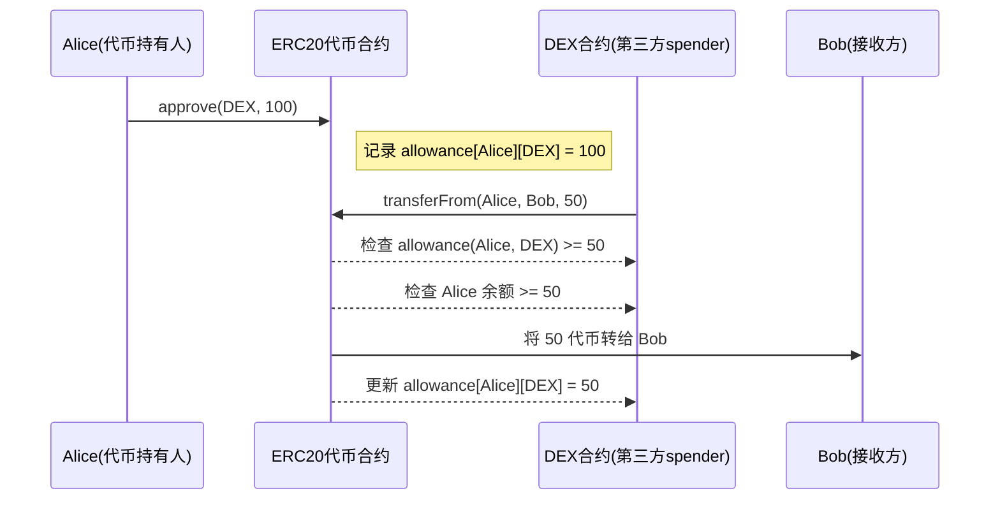

## **📅 第 2 周：ERC 标准与可升级合约**

目标：掌握 ERC 系列、升级模式并能部署到测试网。

---

## **D8 — ERC-20 从零实现**

- **学习点**：
    - ERC-20 接口（`totalSupply`/`transfer`/`approve`/`transferFrom`/`allowance`）
    - 事件 `Transfer` / `Approval`
- **实操任务**：
    - 实现 `MyToken.sol`（ERC-20）
- **测试**：
    - Hardhat 测试转账、授权转账
- **输出**：执行交易事件截图

---

### 示例代码

```solidity
// SPDX-License-Identifier: UNLICENSED
pragma solidity ^0.8.10;

/*
   从零实现 ERC-20
    - ERC-20 接口（`totalSupply`/`transfer`/`approve`/`transferFrom`/`allowance`）
    - 事件`Transfer`/`Approval`
 */
/*
 * 为什么需要授权机制？
 * - ERC20 的授权机制本质上是为了实现 用户授予第三方地址在限定额度内代为转账的能力，这既提升了安全性，又为复杂的链上交互（如交易所、合约交互、自动扣费）提供了必要基础。
 */
contract MyToken {

    string public name = "MyToken";                 // 货币名称
    string public symbol = "MTK";                   // 货币标记
    uint8 public decimals = 18;                     // 它表示 代币的最小分割单位，18 是业界最常用的默认值（和以太币 ETH 一样）。
    uint256 public totalSupply;                     // 总供应链

    mapping(address => uint256) private balances;   // 每个账户余额

    // 授权额度 mapping: owner => (spender => amount)
    // 每个账户（owner）针对每个被授权人（spender）能够代替自己花费多少代币。
    mapping(address => mapping(address => uint256)) private allowances;

    // 转账事件
    event Transfer(address indexed from, address indexed to, uint256 value);
    // 授权事件
    event Approval(address indexed owner, address indexed spender, uint256 value);

    // 初始发行代币给部署者
    constructor(uint256 initialSupply){
        // 10 ** uint256(decimals)：因为 Solidity 里 ** 是幂运算，这里表示 10^18 次方
        // totalSupply 转换成最小单位存储（int类型）
        totalSupply = initialSupply * (10 ** uint256(decimals));
        balances[msg.sender] = totalSupply;
        // address(0) 是 Solidity 里全零地址（0x0000000000000000000000000000000000000000）。
        // 铸造（Mint）代币： 从 0x0 -> 某用户，表示“从无到有”生成代币（新币）
        // 销毁（Burn）代币： 从某用户 -> 0x0，表示“从有到无”销毁代币
        emit Transfer(address(0), msg.sender, totalSupply);
    }

    // 定义 public ，合约内外都能访问；external 只能外部访问或用 this. 访问
    function balanceOf(address account) public view returns (uint256){
        return balances[account];
    }

    // 转账给 `to`
    function transfer(address to, uint256 amount) public returns (bool) {
        require(to != address(0), "ERC20: transfer to the zero address");
        require(balances[msg.sender] >= amount, "ERC20: transfer amount exceeds balance");
        balances[msg.sender] -= amount;
        balances[to] += amount;
        emit Transfer(msg.sender,to, amount);
        return true;
    }

    //  授权 spender 从当前用户花费 amount
    function approve(address spender, uint256 amount) public returns (bool){
        require(spender != address(0), "ERC20: approve to the zero address");
        allowances[msg.sender][spender] = amount;
        emit Approval(msg.sender, spender, amount);
        return true;
    }

    // 查询授权额度
    function allowance(address owner, address spender) public view returns (uint256){
        return allowances[owner][spender];
    }

    // 有授权记录，才能发起
    // spender 从 from 地址转账给 to
    function transferFrom(address from, address to, uint256 amount) public returns (bool){
        require(to != address(0), "ERC20: transfer to zero address");
        require(balances[from] >= amount, "ERC20: amount exceeds balance");
        require(allowances[from][msg.sender] >= amount, "ERC20: amount exceeds allowance");

        // 更新余额和授权
        balances[from] -= amount;
        balances[to] += amount;
        allowances[from][msg.sender] -= amount;

        emit Transfer(from, to, amount);
        return true;
    }

}

```

### 测试代码

```solidity
// SPDX-License-Identifier: MIT
pragma solidity ^0.8.20;

import "./MyToken.sol";
import "forge-std/Test.sol";

contract MyTokenTest is Test {

    MyToken token;
    address owner;
    address addr1;
    address addr2;

    function setUp() public {
        // address(this) 表示当前测试合约的地址。
        owner = address(this);
        addr1 = vm.addr(1);
        addr2 = vm.addr(2);

        // 部署 ERC-20 合约
        token = new MyToken(1000); // initialSupply = 1000
    }

    function testInitialSupplyAssignedToOwner() public {
        assertEq(token.balanceOf(owner), token.totalSupply());
    }

    function testTransferEmitsEventAndBalancesUpdate() public {
        uint256 amountWholeCoins = 50;
        uint256 amountWei = amountWholeCoins * (10 ** token.decimals());

        // 参数 emitter，指定事件是由哪个合约地址发出的
        vm.expectEmit(true, true, false, true, address(token));
        emit MyToken.Transfer(owner, addr1, amountWei);
        bool success = token.transfer(addr1, amountWei);
        assertTrue(success);

        assertEq(token.balanceOf(addr1), amountWei);
        assertEq(token.balanceOf(owner), token.totalSupply() - amountWei);
    }

    /*
     * owner----授权100------------------> addr1
     * addr1----将owner授权的100--->转账--> addr2
     */
    function testApproveAndTransferFrom() public {
        // 授权 addr1
        vm.expectEmit(true, true, false, true);
        emit MyToken.Approval(owner, addr1, 100);
        // 调用 授权
        assertTrue(token.approve(addr1, 100));
        // 查询 授权
        assertEq(token.allowance(owner, addr1), 100);

        // 用 addr1 调用 transferFrom
        vm.prank(addr1);
        vm.expectEmit(true, true, false, true);
        emit MyToken.Transfer(owner, addr2, 60);

        assertTrue(token.transferFrom(owner, addr2, 60));
        assertEq(token.balanceOf(addr2), 60);
        assertEq(token.allowance(owner, addr1), 40);
    }

    function testTransferShouldFailIfBalanceNotEnough() public {
        vm.prank(addr1);
        vm.expectRevert(bytes("ERC20: transfer amount exceeds balance"));
        token.transfer(addr2, 10);
    }

    function testTransferFromShouldFailIfAllowanceNotEnough() public {
        assertTrue(token.approve(addr1, 10));
        vm.prank(addr1);
        vm.expectRevert(bytes("ERC20: amount exceeds allowance"));
        token.transferFrom(owner, addr2, 20);
    }
}
```

### 总结

**为什么需要授权机制？**

> ERC20 的授权机制本质上是为了实现 **用户授予第三方地址在限定额度内代为转账的能力**，这既提升了安全性，又为复杂的链上交互（如交易所、合约交互、自动扣费）提供了必要基础。

**ERC20 授权转账流程交互图**




--------


## **D9 — 增强 ERC-20**

- **任务**：
    - 增加 `mint`（仅 owner 可调用）
    - 增加最大发行量限制
- **测试**：
    - 超过 maxSupply 时应 revert

---

### 示例代码

```solidity
// SPDX-License-Identifier: UNLICENSED
pragma solidity ^0.8.10;

import "@openzeppelin/contracts/token/ERC20/ERC20.sol";
import "@openzeppelin/contracts/access/Ownable.sol";

/**
 * 基于 OpenZeppelin 的 ERC20 实现，增加 mint 方法和 maxSupply 限制。
 */
contract MyToken is ERC20, Ownable {

    uint256 public immutable maxSupply; // 最大供应量（单位：最小单位）

    // 构造函数，继承 ERC20 和 Ownable，传入初始化参数
    constructor(
        string memory name_,
        string memory symbol_,
        uint256 maxSupply_
    ) ERC20(name_, symbol_) Ownable(msg.sender){
        require(maxSupply_ > 0, "Max supply must be > 0");
        maxSupply = maxSupply_;
    }

    // 铸造新代币（只有合约所有者可以调用）
    function mint(address to, uint256 amount) external onlyOwner{
        require(totalSupply() + amount <= maxSupply, "Mint exceeds max supply");
        _mint(to, amount);
    }
}
```

--------

### 测试代码

```solidity
// SPDX-License-Identifier: MIT
pragma solidity ^0.8.20;

import "./MyToken.sol";
import "forge-std/Test.sol";

contract MyTokenTest is Test{

    MyToken token;
    address owner;
    address alice;
    uint256 constant MAX_SUPPLY = 1000 ether;

    function setUp() public {
        owner = address(this); // 测试合约本身作为 owner
        alice = address(0x1);
        token = new MyToken("MyToken", "MTK", MAX_SUPPLY);
    }

    function testOwnerCanMint() public {
        token.mint(alice, 500 ether);
        assertEq(token.totalSupply(), 500 ether);
        assertEq(token.balanceOf(alice), 500 ether);
    }

    function testRevertIfNonOwnerMint() public {
        vm.prank(alice); // 设置调用者为 alice

        // 期望错误 Ownable.OwnableUnauthorizedAccount
        // 错误选择器 (selector)：在 Solidity 里，每个错误类型（error）都有一个唯一的 4 字节选择器。
        vm.expectRevert(
            abi.encodeWithSelector(Ownable.OwnableUnauthorizedAccount.selector, alice)
        );
        token.mint(alice, 10 ether);
    }

    function testRevertIfExceedsMaxSupply() public {
        token.mint(alice, 1000 ether);
        vm.expectRevert(bytes("Mint exceeds max supply"));
        token.mint(alice, 1 ether);
    }
}
```

--------

### ERC-20 扩展合约

| 合约名                               | 功能作用                                                     | 常见应用场景                              |
| ------------------------------------ | ------------------------------------------------------------ | ----------------------------------------- |
| **draft‑ERC20Bridgeable.sol**        | （草案草稿，未正式标准化）提供跨链桥功能，把 ERC‑20 转移到其他链的机制 | Layer2 ↔ Layer1 跨链资产                  |
| **draft‑ERC20TemporaryApproval.sol** | 临时授权机制（短期时间窗内有效的 `allowance`）               | 减少长时间授权带来的安全风险              |
| **ERC20Burnable.sol**                | 持有人或被授权者可**销毁（burn）**自己的代币                 | 通缩模式、代币回收                        |
| **ERC20Capped.sol**                  | 代币总量有上限（`maxSupply`），超过则 mint 失败              | 固定供应量的币种（类似 BTC 的 2100 万枚） |
| **ERC20FlashMint.sol**               | 支持 Flash Mint，瞬时借出代币、同交易内归还                  | DeFi 闪电贷、套利策略                     |
| **ERC20Pausable.sol**                | 提供全局暂停转账 / mint / burn 的功能                        | 紧急停止交易、漏洞响应                    |
| **ERC20Permit.sol**                  | 支持 EIP‑2612 的 `permit` 功能，用签名授权而无需 on‑chain `approve` | Gasless Approve，无需先用交易授权         |
| **ERC20Votes.sol**                   | 将持有的 ERC‑20 转化为治理投票权（快照机制）                 | DAO 治理代币、链上投票                    |
| **ERC20Wrapper.sol**                 | 把其他 ERC‑20 包装成新的 ERC‑20（1:1 绑定），用于兼容性或添加功能 | 包装旧代币、跨链映射                      |
| **ERC1363.sol**                      | 实现 ERC‑1363 标准，支持支付+回调（`transferAndCall`）       | 智能支付合约、自动执行交易逻辑            |
| **ERC4626.sol**                      | 实现 EIP‑4626（Vault 标准），ERC‑20 作为存款凭证，可以代表池中的份额 | 收益型代币、金库资产管理                  |
| **IERC20Metadata.sol**               | 提供 `name`、`symbol`、`decimals` 的接口定义                 | 元数据读取标准                            |
| **IERC20Permit.sol**                 | 定义 `permit` 接口（签名授权），是 ERC20Permit 的接口声明    | 兼容各种 DApp 的 Permit 功能              |


--------

## **D10 — ERC-721 实现与 Mint**

- **学习点**：
    - ERC-721 基本方法（`safeMint`、`tokenURI`）
- **任务**：
    - 实现 `MyNFT.sol`，mint 时设置自定义 URI

---

### 示例代码

```solidity
// SPDX-License-Identifier: UNLICENSED
pragma solidity ^0.8.10;

import "@openzeppelin/contracts/token/ERC721/extensions/ERC721URIStorage.sol";
import "@openzeppelin/contracts/access/Ownable.sol";

/**
 * - **学习点**：
      - ERC-721 基本方法（`safeMint`、`tokenURI`）
   - **任务**：
      - 实现`MyNFT.sol`，mint 时设置自定义 URI
 */
contract MyNFT is ERC721URIStorage, Ownable {

    uint256 private _nextTokenId;

    constructor(string memory name_, string memory symbol_)
    ERC721(name_, symbol_)
    Ownable(msg.sender) // 传入 deployer 作为初始 owner
    {}

    // 铸造 NFT 并设置 URI
    function safeMint(address to, string memory uri) external onlyOwner {
        uint256 tokenId = _nextTokenId;
        _nextTokenId++;

        _safeMint(to, tokenId);
        _setTokenURI(tokenId, uri);
    }

    // 批量铸造 NFTs，并为每个设置独立 URI
    function batchSafeMint(address[] calldata recipients, string[] calldata uris) external onlyOwner {
        require(recipients.length == uris.length, "MyNFT: recipients and uris length mismatch");

        for (uint256 i = 0; i < recipients.length; i++) {
            uint256 tokenId = _nextTokenId;
            _nextTokenId++;

            _safeMint(recipients[i], tokenId);
            _setTokenURI(tokenId, uris[i]);
        }
    }

    // 获取下一个可用 tokenId
    function nextTokenId() external view returns (uint256) {
        return _nextTokenId;
    }
}

```

--------

### 测试代码

```solidity
// SPDX-License-Identifier: MIT
pragma solidity ^0.8.20;

import "./MyNFT.sol";
import "forge-std/Test.sol";

contract MyNFTTest is Test {
    MyNFT public nft;
    address public alice;
    address public owner;

    function setUp() public {
        owner = address(this);
        alice = address(0x1);
        nft = new MyNFT("MyNFT", "MNFT");
    }

    function testSafeMintAndTokenURI() public {
        string memory uri = "https://nft.example/metadata/1.json";

        nft.safeMint(alice, uri);

        assertEq(nft.ownerOf(0), alice);
        assertEq(nft.tokenURI(0), uri);
        assertEq(nft.nextTokenId(), 1);
    }

    function testRevertIfNonOwnerMint() public {
        vm.prank(alice);
        vm.expectRevert(
            abi.encodeWithSelector(Ownable.OwnableUnauthorizedAccount.selector, alice)
        );
        nft.safeMint(alice, "https://nft.example/metadata/2.json");
    }
}
```

--------

### ERC721 扩展合约

| 文件                      | 作用                                                         | 常见应用场景                                                 |
| ------------------------- | ------------------------------------------------------------ | ------------------------------------------------------------ |
| **ERC721Burnable.sol**    | 允许 NFT 持有人或获授权者销毁（`burn`）自己的 NFT。销毁后 `tokenId` 永久不存在。 | 游戏道具回收、销毁过期会员卡、通缩 NFT                       |
| **ERC721Consecutive.sol** | 支持 **连续批量铸造**（一次性 mint 一批连续 ID 的 NFT），符合 [ERC‑2309](https://eips.ethereum.org/EIPS/eip-2309) 标准，可节省 gas 成本。 | 一次性发行几千/几万个 NFT 系列（头像、PFP 项目）             |
| **ERC721Enumerable.sol**  | 提供 **枚举功能**，可以在链上遍历所有 NFT：`totalSupply()`、`tokenByIndex()`、`tokenOfOwnerByIndex()`。 | 区块链浏览器、DApp 内需要列出用户所有 NFT 的情况（需要注意增加 gas 消耗） |
| **ERC721Pausable.sol**    | 增加暂停功能（`pause()`/`unpause()`），暂停时禁止转账、mint、burn。 | 紧急情况下冻结交易（安全事故、漏洞修复期间）                 |
| **ERC721Royalty.sol**     | 实现 [EIP‑2981](https://eips.ethereum.org/EIPS/eip-2981) 版权版税标准，使 NFT 市场在二级交易中自动向创作者支付版税。 | 艺术品交易、音乐版权分成                                     |
| **ERC721URIStorage.sol**  | 为每个 `tokenId` 存储独立的 `tokenURI`（链上存储 URI 信息），而不是通过 `baseURI+tokenId` 方式统一生成。 | 每个 NFT 对应不同元数据（如不同图片、音频等资源地址）        |
| **ERC721Votes.sol**       | 将 NFT 拥有权映射为治理投票权，结合快照功能支持链上治理。    | 基于 NFT 的 DAO 投票系统（如土地所有权决策）                 |
| **ERC721Wrapper.sol**     | 可将现有 NFT **包装**为新的 ERC‑721 代币，比如在跨链或需要增加功能时使用。 | 旧 NFT 升级、新链映射、加额外功能                            |
| **IERC721Enumerable.sol** | **接口声明**（`ERC721Enumerable` 对应的接口），定义枚举所需的标准函数签名，方便交互。 | 合约间接口调用、标准化数据访问                               |
| **IERC721Metadata.sol**   | **接口声明**（NFT 元数据接口），定义 `name()`、`symbol()`、`tokenURI()` 等。 | 向钱包、市场或 DApp 提供名称/符号/元数据读取支持             |


--------


## **D11 — 增加白名单机制**

- **学习点**：
    - Merkle Tree 白名单验证
- **任务**：
    - 使用 `merkletreejs` 在 Node 端生成白名单
    - Mint 需提供 Proof 验证


> **Merkle Tree 白名单**可以让我们：
>
> - 在合约中只存 **Merkle Root**（一个 32 字节哈希）
> - 白名单用户的地址通过 **Merkle Proof** 在链上验证
>
> 这样不会把整个白名单地址数组放链上（节省 gas）。

---

### 示例代码

1. **Node.js 端用 `merkletreejs` 生成 Merkle Root + Proof**

   ```bash
   // 安装依赖
   npm install merkletreejs keccak256
   ```

   脚本**scripts/day1/genMerkle.js**

   ```js
   import keccak256 from 'keccak256';
   import { MerkleTree } from 'merkletreejs';
   
   // 假设白名单名单
   const whitelistAddresses = [
       "0x1111111111111111111111111111111111111111",
       "0x2222222222222222222222222222222222222222",
       "0x3333333333333333333333333333333333333333"
   ];
   
   // 1. 生成叶子节点（地址小写并去除 0x 前缀哈希）
   const leafNodes = whitelistAddresses.map(addr => keccak256(addr.toLowerCase()));
   // 2. 构造 Merkle 树（排序 true 保证一致性）
   const merkleTree = new MerkleTree(leafNodes, keccak256, { sortPairs: true });
   
   // 3. 根节点（部署时要放链上）
   const root = merkleTree.getHexRoot();
   console.log("Merkle Root:", root);
   
   // 4. 模拟生成某个地址的 proof
   const claimingAddress = "0x2222222222222222222222222222222222222222";
   const proof = merkleTree.getHexProof(keccak256(claimingAddress.toLowerCase()));
   console.log("Proof for", claimingAddress, ":", proof);
   ```

   终端运行 ` node scripts/day11/genMerkle.js`，输出：

   ```
   Merkle Root: 0xcbf843e9efe7be41ca4d3a03347d27e7bb96d83ae75b3b36983ad907d2109c65
   Proof for 0x2222222222222222222222222222222222222222 : [
     '0xe2c07404b8c1df4c46226425cac68c28d27a766bbddce62309f36724839b22c0',
     '0x37d95e0aa71e34defa88b4c43498bc8b90207e31ad0ef4aa6f5bea78bd25a1ab'
   ]
   ```

2. **Solidity 合约端存储 merkleRoot 并在 mint 时验证 proof**

   ```solidity
   // SPDX-License-Identifier: UNLICENSED
   pragma solidity ^0.8.10;
   
   import "@openzeppelin/contracts/token/ERC721/extensions/ERC721URIStorage.sol";
   import "@openzeppelin/contracts/access/Ownable.sol";
   import "@openzeppelin/contracts/utils/cryptography/MerkleProof.sol";
   
   /*
       D11 任务是要实现 基于 Merkle Tree 的链上白名单 Mint。
       分三步完成：
           Node.js 端用 merkletreejs 生成 Merkle Root + Proof
           Solidity 合约端存储 merkleRoot 并在 mint 时验证 proof
           Foundry 测试：模拟 Node 计算 proof，然后调用合约验证 mint 流程
    */
   contract WhitelistNFT is ERC721URIStorage, Ownable {
   
       bytes32 public merkleRoot;
       uint256 private _nextTokenId;
       mapping(address => bool) public minted; // 防止重复 mint
   
       constructor(bytes32 root_) ERC721("WhitelistNFT", "WNFT") Ownable(msg.sender){
           merkleRoot = root_;
       }
   
       function safeMint(address to, string memory uri, bytes32[] calldata proof) external {
           require(!minted[to], "Already minted");
   
           // 1. 计算 leaf
           bytes32 leaf = keccak256(abi.encodePacked(to));
   
           // 2. 验证 proof
           require(MerkleProof.verify(proof, merkleRoot, leaf), "Not in whitelist");
   
           // 3. 铸造
           uint256 tokenId = _nextTokenId++;
           _safeMint(to, tokenId);
           _setTokenURI(tokenId, uri);
           minted[to] = true;
       }
   }
   ```

   

### 测试代码

```solidity
// SPDX-License-Identifier: MIT
pragma solidity ^0.8.20;

import "./WhitelistNFT.sol";
import "forge-std/Test.sol";

contract WhitelistNFTTest is Test {

    WhitelistNFT public nft;

    function setUp() public {
        // 这里替换成 Node 脚本生成的 root
        bytes32 root = 0xcbf843e9efe7be41ca4d3a03347d27e7bb96d83ae75b3b36983ad907d2109c65; // 用实际的 merkleRoot 替换
        nft = new WhitelistNFT(root);
    }

    function testMintWithProof() public {
        address user = 0x2222222222222222222222222222222222222222;
        // 这里替换成 Node 脚本生成的 proof
        bytes32[] memory proof = new bytes32[](2);
        proof[0] = 0xe2c07404b8c1df4c46226425cac68c28d27a766bbddce62309f36724839b22c0;
        proof[1] = 0x37d95e0aa71e34defa88b4c43498bc8b90207e31ad0ef4aa6f5bea78bd25a1ab;

        nft.safeMint(user, "https://example.com/token/1.json", proof);

        assertEq(nft.ownerOf(0), user);
        assertTrue(nft.minted(user));
    }

    function testFailMintWithoutProof() public {
        address attacker = address(0x999);
        bytes32[] memory fakeProof = new bytes32[](0);
        vm.expectRevert(bytes("Not in whitelist"));
        nft.safeMint(attacker, "https://example.com/token/2.json", fakeProof);
    }
}
```


--------

## **D12 — 可升级合约 Transparent Proxy**

- **学习点**：
    - Proxy 存储槽避免冲突
    - Transparent Proxy 部署方式
- **任务**：
    - 部署 MyToken V1
    - 升级到 V2，新增 `burn()` 方法

---

### 示例代码

```bash
// 安装依赖
npm install @openzeppelin/contracts-upgradeable
forge install OpenZeppelin/openzeppelin-contracts-upgradeable
```

```solidity
// SPDX-License-Identifier: UNLICENSED
pragma solidity ^0.8.10;

import "@openzeppelin/contracts-upgradeable/token/ERC20/ERC20Upgradeable.sol";
import "@openzeppelin/contracts-upgradeable/proxy/utils/Initializable.sol";

/**
 * 可升级ERC20版本1
 */
contract MyTokenV1 is Initializable, ERC20Upgradeable {

    /*
        不能在构造函数里初始化，因为逻辑合约是通过 Proxy delegatecall 调用，构造函数只会在逻辑合约部署时执行一次（不会初始化 Proxy 的数据）。
        必须用 initialize() 来设置初始值，只允许执行一次（initializer 修饰器）。
     */

    function initialize(string memory name_, string memory symbol_) public initializer {
        __ERC20_init(name_, symbol_);
        _mint(msg.sender, 1000 * 10 ** decimals());
    }

    function mint(address to, uint256 amount) external {
        _mint(to, amount);
    }
}
```

```solidity
// SPDX-License-Identifier: UNLICENSED
pragma solidity ^0.8.10;

import "./MyTokenV1.sol";

/**
 * 升级版，增加 burn 功能
 */
contract MyTokenV2 is MyTokenV1 {
    function burn(address from, uint256 amount) external {
        _burn(from, amount);
    }
}

```

------

### 测试代码

文件：ProxyUpgrade.t.sol

```solidity
// SPDX-License-Identifier: MIT
pragma solidity ^0.8.20;

import "./MyTokenV1.sol";
import "./MyTokenV2.sol";
import "@openzeppelin/contracts/proxy/transparent/ProxyAdmin.sol";
import "@openzeppelin/contracts/proxy/transparent/TransparentUpgradeableProxy.sol";
import "forge-std/Test.sol";


contract ProxyUpgradeTest is Test {
    address owner = address(this);

    TransparentUpgradeableProxy proxy;
    ProxyAdmin proxyAdmin;

    // ERC1967 admin 槽常量（固定值）
    bytes32 constant ADMIN_SLOT = 0xb53127684a568b3173ae13b9f8a6016e243e63b6e8ee1178d6a717850b5d6103;

    function setUp() public {
        // 部署逻辑合约 V1
        MyTokenV1 v1 = new MyTokenV1();

        // 初始化数据
        bytes memory initData = abi.encodeWithSignature(
            "initialize(string,string)",
            "MyToken",
            "MTK"
        );

        // 部署透明代理（OZ v5 会自动 new ProxyAdmin）
        proxy = new TransparentUpgradeableProxy(
            address(v1),
            owner, // initialOwner
            initData
        );

        // ✅ 用 Foundry vm.load 读取真实的 admin 地址
        address adminAddr = address(uint160(uint256(
            vm.load(address(proxy), ADMIN_SLOT)
        )));
        proxyAdmin = ProxyAdmin(adminAddr);
    }

    function testUpgrade() public {
        // 通过代理调用 V1 的方法
        MyTokenV1 tokenV1 = MyTokenV1(address(proxy));
        assertEq(tokenV1.name(), "MyToken");

        tokenV1.mint(owner, 100);
        assertEq(
            tokenV1.balanceOf(owner),
            1000 * 10 ** tokenV1.decimals() + 100
        );

        // 部署逻辑合约 V2
        MyTokenV2 v2 = new MyTokenV2();

        // ✅ 使用真实 ProxyAdmin 升级
        proxyAdmin.upgradeAndCall(
            ITransparentUpgradeableProxy(address(proxy)),
            address(v2),
            ""
        );

        // 升级完成后用 V2 接口交互
        MyTokenV2 tokenV2 = MyTokenV2(address(proxy));

        tokenV2.burn(owner, 100);
        assertEq(
            tokenV2.balanceOf(owner),
            1000 * 10 ** tokenV2.decimals()
        );
    }
}
```

--------

### 总结

在 **透明代理模式 (Transparent Proxy Pattern)** 里，代理合约本身其实不存业务逻辑，它只是：

- 存了几个重要的 **固定位置的变量（slot）**
- 把调用转发（delegatecall）到实际的实现合约（Logic）

最重要的是这几个 slot，它们来自 **EIP‑1967 标准**：

| 名称                   | 常量 slot 值                                                 | 作用                                       |
| ---------------------- | ------------------------------------------------------------ | ------------------------------------------ |
| `_ADMIN_SLOT`          | `0xb53127684a568b3173ae13b9f8a6016e243e63b6e8ee1178d6a717850b5d6103` | 存当前代理的管理员地址（只有它能升级实现） |
| `_IMPLEMENTATION_SLOT` | `0x360894a13ba1a3210667c828492db98dca3e2076cc3735a920a3ca505d382bbc` | 存当前逻辑合约（实现合约）地址             |
| `_BEACON_SLOT`（可选） | `0xa3f0ad74e5423aebfd80d3ef4346578335a9a72aeaee59ff6cb3582b3a2cc5fa` | 存 Beacon 地址（用于 Beacon Proxy 模式）   |

这些 slot 是通过哈希计算固定出来的（`keccak256("eip1967.proxy.admin") - 1` 等），这样可以确保：

- 它们不会和逻辑合约中普通变量的 slot 冲突
- 即使逻辑合约升级、多次部署，也能在相同位置找到这些关键数据


--------

## **D13 — 部署到测试网**

- **任务**：
    - 用 Foundry 网络配置部署到 Sepolia
      
    - 使用 Etherscan API 验证合约

---

### Sepolia测试网

Sepolia是以太坊核心开发人员为智能合约应用程序开发推荐的默认测试网。Sepolia最初是由以太坊核心开发人员于2021年10月推出的一种权威性测试网。该网络后来转变为一种权益证明共识机制，以模拟以太坊主网的运行环境。

水龙头：https://www.alchemy.com/faucets/ethereum-sepolia

测试网区块链浏览器：https://sepolia.etherscan.io/

申请 ETHERSCAN_API_KEY ：https://etherscan.io/apidashboard

申请 SEPOLIA_RPC_URL：https://dashboard.alchemy.com/

--------

### 部署脚本

创建``.env`` 文件，`.env` 务必加到 `.gitignore` 防止泄露。

```
SEPOLIA_RPC_URL=https://eth-sepolia.g.alchemy.com/v2/你的AlchemyKey
PRIVATE_KEY=0x你的私钥
ETHERSCAN_API_KEY=你的EtherscanApiKey
```

`foundry.toml`（配置 Foundry）

```toml
[profile.default]
...
compiler-version = "0.8.30"
optimizer = true
optimizer_runs = 200
...
[rpc_endpoints]
sepolia = "${SEPOLIA_RPC_URL}"
```

`scripts/day13/Deploy.s.sol`

```solidity
// SPDX-License-Identifier: MIT
pragma solidity ^0.8.22;

import "../../contracts/day09/MyToken.sol";
import "forge-std/Script.sol";

contract DeployScript is Script {
    function run() external {
        uint256 deployerPrivateKey = vm.envUint("PRIVATE_KEY");
        vm.startBroadcast(deployerPrivateKey);

        // 部署合约（构造参数可以换成你自己的）
        MyToken token = new MyToken("MyToken", "MTK",1000);

        vm.stopBroadcast();

        console.log("MyToken deployed to:", address(token));
    }
}
```

**一键部署 + 验证命令**

```bash
forge script scripts/day13/Deploy.s.sol \
  --rpc-url sepolia \
  --broadcast \
  --verify \
  --etherscan-api-key 你的EtherscanApiKey
```

**解释：**

- `--broadcast` 👉 把交易发到链上（Sepolia）
- `--verify` 👉 部署完成后立即把源码和编译信息发送给 Etherscan
- `--etherscan-api-key` 👉 验证需要 Etherscan 提供的 API Key

部署日志：

```
##### sepolia
✅  [Success] Hash: 0x8429198890e8625eabc1ad933ad9a9cd4dbcc70297da6cd5022a1b93cbaedaba
Contract Address: 0xf37d842A936c35596A85aDb8ec1DB8Ee9Aa5b4e5
Block: 9387347
Paid: 0.00000065075401482 ETH (650741 gas * 0.00100002 gwei)
```

验证完成后，浏览器查看：

```
https://sepolia.etherscan.io/address/0xf37d842a936c35596a85adb8ec1db8ee9aa5b4e5#code
```

会看到：

- Solidity 源码
- ABI
- 可读/可写函数菜单

-------

### **在 MetaMask 添加你部署的代币**

1. 打开 MetaMask，**切换到 Sepolia 网络**

   - 如果没添加测试网，在 MetaMask 设置 → 高级 → 开启 “显示测试网络”
   - 网络选择 **Sepolia Test Network**

2. 找到你的代币合约地址 在部署日志里有：

   ```
   MyToken deployed to: 0xf37d842A936c35596A85aDb8ec1DB8Ee9Aa5b4e5
   ```

   这个就是你代币合约地址。

3. 点击 MetaMask 界面底部 → **导入代币（Import tokens）**

4. 输入：

   - **Token Contract Address** → 你的 ERC20 合约地址
   - **Symbol**（可选） → MyToken (MTK)
   - **Decimals** → 如果是 ERC20 通常是 `18`

5. 确认添加

6. 现在你钱包界面右侧就能看到你的代币余额（目前可能是 0）

--------

### **给自己账号转代币**

```bash
  cast send 0xMyTokenContractAddress \
  "mint(address,uint256)" \
  0xYourAddress \
  100 \
  --rpc-url sepolia \
  --private-key 你的部署合约的私钥
```

对 `0xMyTokenContractAddress`、`0xYourAddress` 进行替换。

执行成功日志

```
blockHash            0x744d5fb64bbbb8726c5a8dc88684e7af744bbfcb901a1092648eb6e95c5b392c
blockNumber          9387577
contractAddress      
cumulativeGasUsed    10598200
effectiveGasPrice    1000023
from                 0xf162E7beCA3bE717A71254676aFB274A9815B629
gasUsed              70805
logs                 [{"address":"0xf37d842a936c35596a85adb8ec1db8ee9aa5b4e5","topics":["0xddf252ad1be2c89b69c2b068fc378daa952ba7f163c4a11628f55a4df523b3ef","0x0000000000000000000000000000000000000000000000000000000000000000","0x000000000000000000000000f162e7beca3be717a71254676afb274a9815b629"],"data":"0x0000000000000000000000000000000000000000000000000000000000000064","blockHash":"0x744d5fb64bbbb8726c5a8dc88684e7af744bbfcb901a1092648eb6e95c5b392c","blockNumber":"0x8f3e39","blockTimestamp":"0x68ea0040","transactionHash":"0x0e46d90657f90f7d8e6224d3807565e73a25e1d3043aa979c612f7abfe7fc0fb","transactionIndex":"0x29","logIndex":"0x24","removed":false}]
logsBloom            0x00000000000000000000000000000000000000000000000000000000000080000000000000000000000000000000000000000000000000000000000000000000000000000000000000000008000000000000000000000800000000000000000000000000020000000000000000000800000000000000000000000010000000000000000000000000000000000000000000000000000000000080000000000000000000000000000000000000000000000000000020000000000000000000000000000202000000000000400000000000000000000000000000000000000020000000000000000000000000000000000000000000000000000000000000000000
root                 
status               1 (success)
transactionHash      0x0e46d90657f90f7d8e6224d3807565e73a25e1d3043aa979c612f7abfe7fc0fb
transactionIndex     41
type                 2
blobGasPrice         
blobGasUsed          
to                   0xf37d842A936c35596A85aDb8ec1DB8Ee9Aa5b4e5
```


--------

## **D14 — 复盘**

- ERC 标准知识总结表

--------

| 标准编号     | 类型 / 全称                          | 主要用途                                   | 核心方法                                                     | 常用场景                           |
| ------------ | ------------------------------------ | ------------------------------------------ | ------------------------------------------------------------ | ---------------------------------- |
| **ERC-20**   | Fungible Token（同质化代币标准）     | 定义可替代代币的转账和余额管理规则         | `totalSupply()`、`balanceOf(address)`、`transfer(address,uint256)`、`approve(address,uint256)`、`transferFrom(address,uint256)` | 稳定币、治理代币、积分系统         |
| **ERC-721**  | Non-Fungible Token（NFT 标准）       | 唯一、不可替代资产的标准接口               | `ownerOf(uint256)`、`balanceOf(address)`、`safeTransferFrom(address,uint256)`、`tokenURI(uint256)` | NFT 艺术品、游戏物品、门票         |
| **ERC-1155** | Multi-Token Standard（批量代币标准） | 同时支持同质化和非同质化代币               | `balanceOf(address,uint256)`、`balanceOfBatch(address[],uint256[])`、`safeTransferFrom(address,address,uint256,uint256,bytes)` | 链游物品、批量资产转移             |
| **ERC-777**  | Advanced Token Standard（高级代币）  | 在 ERC-20 上增加钩子和更安全的 `send` 方法 | `send(address,uint256,bytes)`、`authorizeOperator(address)`、`operatorSend(...)` | 需要更丰富交互的 DeFi 或代币应用   |
| **ERC-2981** | NFT Royalty Standard（NFT 版税）     | 为 NFT 二级销售提供版税信息接口            | `royaltyInfo(uint256,uint256)`                               | NFT 销售抽成、艺术家收益分配       |
| **ERC-165**  | Interface Detection（接口检测标准）  | 检查合约是否实现了某个接口                 | `supportsInterface(bytes4)`                                  | 判断合约可用功能、跨合约兼容性检查 |

💡 记忆技巧：

- **20** → 钱类、积分类（同质化）
- **721** → 独一无二，像身份证编号（NFT）
- **1155** → 混合代币标准（多合一）
- **777** → 高级版 ERC20，带事件钩子
- **2981** → NFT 版税
- **165** → 问合约：“你支持这个接口吗？”


